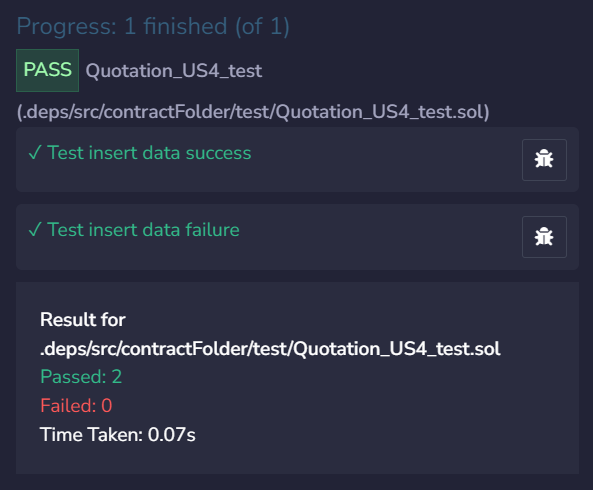
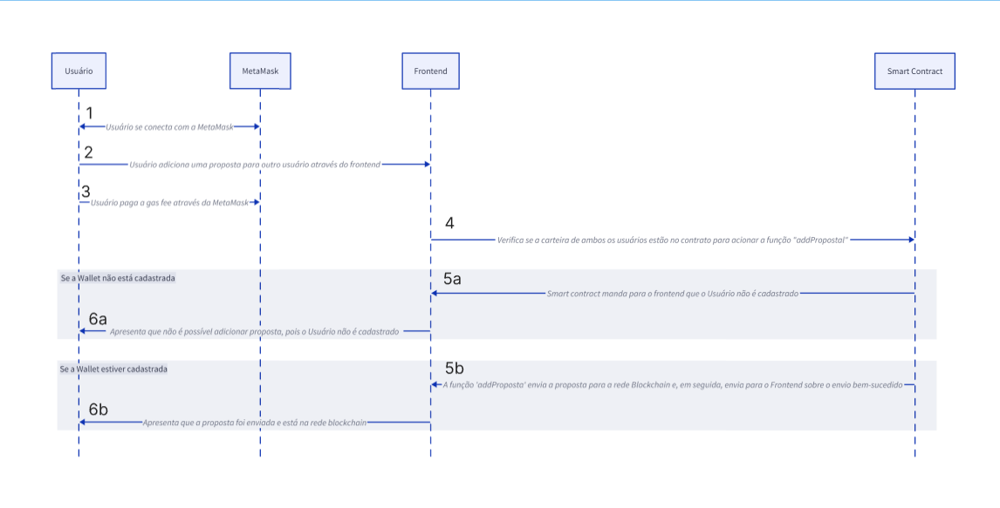
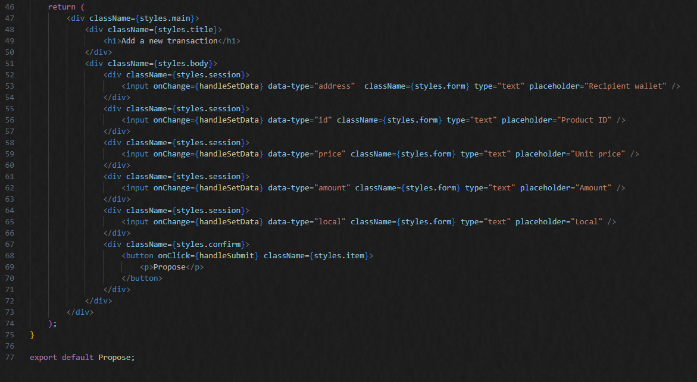
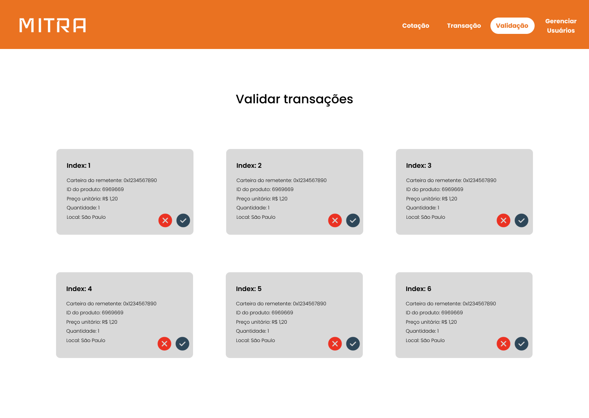

# Documentação DocBlockchain - Módulo 5 - Inteli

<p align="center">
<a href= "https://www.inteli.edu.br/"></a>
</p>

<br>

## Grupo - BlockBriefs
<p align="center">

</p>

## Projeto - MITRA
<p align="center">

</p>

## Integrantes do grupo

- <a href="https://www.linkedin.com/in/erik-batista-da-silva-455612215/">Erik Batista da Silva</a>
- <a href="https://www.linkedin.com/in/thiago-goulart-de-oliveira/">Thiago Goulart de Oliveira</a>
- <a href="https://www.linkedin.com/in/freddy-mester-harari-375860279/">Freddy Mester Harari</a>
- <a href="https://www.linkedin.com/in/matheusmeendes/">Matheus Ferreira Mendes</a>
- <a href="https://www.linkedin.com/in/michel-menahem-khafif-512791201/">Michel Menahem Khafif</a>
- <a href="https://www.linkedin.com/in/otto-bernardo-coutinho-lima/">Otto Bernardo Coutinho Lima</a>
- <a href="https://www.linkedin.com/in/yan-m-coutinho/">Yan Mendonça Coutinho</a>

## Sumário

[1. Introdução](#c1)

[2. Desenvolvimento e Resultados](#c2)

[3. Arquitetura Proposta](#c3)

[4. Descritivo da Solução](#c4)

[5. Testes automatizados](#c5)

[6. Integração Frontend](#c6)

[7. Glossário](#c7)

[8. Referências](#c8)

</br>

# <a id="c1"></a>1. Introdução

<p align="justify">
&emsp;&emsp;Este documento apresenta o projeto de desenvolvimento da Plataforma de Cálculo de Preço Médio para a Alliance, uma empresa líder no setor de compras e fornecimento de produtos e serviços. A Alliance, com sua abrangente atuação no mercado, enfrenta desafios relacionados à transparência de preços ofertados no mercado e à garantia de negociações justas entre fornecedores e clientes. A falta de visibilidade sobre a média os preços praticados pelo mercado e a permanência de fornecedores suspeitos em suas plataformas de <i>marketplace</i> prejudicam o processo de cotação e confiabilidade das tomadas de decisão.
</p>

<p align="justify">
&emsp;&emsp;Este projeto tem como objetivo principal desenvolver uma plataforma de registro e medição de preço médio baseada em tecnologia <i>blockchain</i>, visando facilitar o processo de cotação das empresas clientes do parceiro. Por meio dessa plataforma, a Alliance busca aumentar a transparência nas transações, fornecendo informações confiáveis sobre os preços praticados no mercado.
</p>

## 1.1 Objetivos

<p align="justify">
&emsp;&emsp;Os objetivos deste projeto para a Alliance são determinar o preço médio de mercado para produtos e serviços, com base nos preços históricos registrados na <i>blockchain</i>. Além disso, visa permitir que os usuários realizem negociações justas e transparentes, pagando um preço justo por produtos e serviços. Outro objetivo é fornecer total transparência das transações, garantindo que as informações sobre os preços praticados sejam acessíveis e confiáveis. Adicionalmente, utilizando dados registrados na <i>blockchain</i>, seria possível fornecer <i>insights</i> e análises sobre o comportamento do mercado e as tendências de preços.</p>
<p align="justify">
&emsp;&emsp;Por fim, possibilitar a auditoria das informações por qualquer pessoa participante da rede <i>blockchain</i> necessária para a implementação do projeto, assegurando a integridade e confiabilidade dos dados registrados na plataforma. Esses objetivos visam melhorar significativamente o processo de cotação dos clientes da Alliance, promovendo uma negociação mais justa, transparente e eficiente entre fornecedores e clientes.
</p>

## 1.2 Proposta da solução

<p align="justify">
&emsp;&emsp;A proposta da solução para a Plataforma de Transparência de Preços consiste na implementação de uma plataforma baseada em tecnologia <i>blockchain</i>. Essa plataforma permitirá o registro na <i>blockchain</i> de preços praticados pelo mercado, garantindo a transparência e imutabilidade dos dados. Além disso, oferecerá acesso transparente e seguro às informações de preços pelos usuários da plataforma, facilitando a comparação de preços e tomada de decisões informadas, isso pois, a partir do preço médio, se torna mais fácil perceber se determinado fornecedor está atuando acima ou abaixo do preço de mercado. A solução incluirá funcionalidades para determinar do preço médio de mercado, com base nos preços registrados na <i>blockchain</i>, auxiliando os usuários na negociação de preços justos.</p>

## 1.3 Justificativa

<p align="justify">
&emsp;&emsp;A proposta da plataforma de registro de preço médio apresenta uma série de vantagens e benefícios significativos para a Alliance. Ao adotar essa solução, a empresa poderá melhorar a confiança e credibilidade dos seus serviços aos clientes, isso pois ao oferecer um processo de cotação que permite a aplicação de valores mais justos de acordo com o mercado, a solução terá maior confiabilidade. Além disso, reduzirá o risco de negociações baseadas em informações incompletas ou imprecisas, garantindo que os clientes tenham acesso a dados confiáveis sobre os preços praticados no mercado. A otimização do processo de tomada de decisão será possível, fornecendo informações atualizadas sobre o preço médio praticado no mercado. A solução também promoverá a integridade e transparência nas transações, aumentando a confiança e satisfação dos clientes.</p>
<p align="justify">
&emsp;&emsp;Ao adotar tecnologias avançadas como a <i>blockchain</i> para melhorar os processos de negociação e cotação, a Alliance demonstrará liderança e inovação no setor. Em resumo, a Plataforma de Transparência de Preços representa uma oportunidade estratégica para a Alliance fortalecer sua posição no mercado, promovendo uma cultura de transparência, confiabilidade e equidade nas transações comerciais.
</p>

# <a id="c2"></a>2. Desenvolvimento e Análises
<p align="justify">
&emsp;&emsp;Nesta seção, falaremos inicialmente no domínio de fundamentos de negócio, explorando estratégias e análises que fundamentam a sustentabilidade e o impacto do nosso projeto. Ferramentas como a Matriz de Avaliação de Valor Oceano Azul e o Canvas de Proposta de Valor nos permitirão mapear um território inovador no mercado, enquanto avaliações de risco e análises financeiras asseguram uma implementação realista e economicamente viável.
<p align="justify">
&emsp;&emsp;Em seguida, avançamos para o entendimento da experiência do usuário, onde as Personas e <i>User Stories</i> desempenham um papel crucial em garantir que a plataforma não apenas atenda às necessidades técnicas, mas também ressoe com os usuários finais. Essa parte visa criar uma solução intuitiva e acessível, priorizando a satisfação e a eficácia na utilização da plataforma.
<p align="justify">
&emsp;&emsp;Por fim, a análise de riscos, com um enfoque especial em segurança da informação, sublinha a importância de uma infraestrutura segura. Identificar requisitos de segurança, vulnerabilidades potenciais e possíveis ataques é fundamental para proteger a solução contra ameaças externas, garantindo a integridade e a confiança na plataforma. Esta seção conclui o nosso compromisso em oferecer uma solução transparente, segura e de valor agregado para o setor de <i>Supply Chain</i>.


## 2.1. Domínio de Fundamentos de Negócio
<p align="justify">
&emsp;&emsp;Nesta seção, abordaremos as estratégias chave e avaliações de risco que definem a proposta de valor da Alliance. Utilizando a Matriz de Avaliação de Valor Oceano Azul, demonstraremos como a Alliance se diferencia no mercado, enfatizando suas vantagens em transparência e personalização de serviços em comparação com <i>players</i> estabelecidos como Accenture e Deloitte. Esta análise não só sublinha as áreas de força da Alliance, mas também identifica oportunidades de inovação e crescimento.
<p align="justify">
&emsp;&emsp;Complementando esta análise, a Matriz de Risco e o Canvas de Proposta de Valor oferecem uma visão aprofundada das táticas proativas adotadas pela Alliance para mitigar potenciais desafios, incluindo riscos técnicos e de equipe, e a maximização do valor entregue aos clientes. Estes instrumentos são essenciais para garantir que a plataforma não só atenda às expectativas do mercado, mas também estabeleça novos padrões de eficiência e confiança no ecossistema de <i>Supply Chain</i>.


### 2.1.1. Matriz de avaliação de valor Oceano Azul

<p align="justify">
&emsp;&emsp;A matriz de avaliação do Oceano Azul é uma ferramenta estratégica que auxilia as empresas na identificação de oportunidades de inovação e diferenciação no mercado. Originada a partir do conceito de Estratégia do Oceano Azul, desenvolvido por W. Chan Kim e Renée Mauborgne, essa abordagem propõe que as empresas deixem de competir em mercados saturados e altamente disputados (Oceano Vermelho) e busquem criar novos espaços de mercado, onde a concorrência é irrelevante ou inexistente (Oceano Azul).</p>

<p align="justify">
&emsp;&emsp;No contexto do projeto de cotação de preços para a Alliance, a matriz de avaliação do Oceano Azul se torna uma ferramenta essencial para identificar como a Alliance pode se diferenciar em relação aos concorrentes, como a Accenture e a Deloitte. Através dessa matriz, é possível analisar e comparar atributos importantes para os clientes, como preço, transparência, facilidade de uso da plataforma, entre outros, e identificar ações específicas de Reduzir, Eliminar, Aumentar e Criar que possam ser implementadas para criar um espaço único e inexplorado no mercado, onde a concorrência é menos relevante.</p>

<p align="justify">
&emsp;&emsp;Nesta análise, será possível visualizar como a Alliance pode se posicionar estrategicamente no mercado, oferecendo uma proposta de valor única e atraente para os clientes, enquanto constrói um Oceano Azul de oportunidades e crescimento sustentável para seu negócio.</p>

<p align="justify">
&emsp;&emsp;Como base no que a Alliance oferece hoje, somada à solução em desenvolvimento, realizou-se a Matriz Oceano Azul entre os seguintes concorrentes já mencionados acima: Accenture e Deloitte.</p>

<p align="justify">
  - <b>Accenture</b>: renomada empresa global de consultoria em gestão, tecnologia da informação e <i>outsourcing</i>. Fundada em 1989 e sediada na Irlanda, opera em mais de 200 cidades, oferecendo uma ampla gama de serviços, incluindo consultoria estratégica, desenvolvimento de <i>software</i> e gestão de processos de negócios. Reconhecida por sua expertise em inovação e tecnologia, a Accenture colabora com empresas em todo o mundo para impulsionar o crescimento e enfrentar desafios complexos.</p>

<p align="justify">
  - <b>Deloitte</b>: empresa global de serviços profissionais, fundada em 1845 e sediada em Nova York, EUA. Presente em mais de 150 países, oferece uma ampla gama de serviços, como auditoria, consultoria e assessoria tributária. Reconhecida por sua abordagem multidisciplinar e foco em inovação, busca criar valor para os clientes e promover o desenvolvimento sustentável. A Deloitte também é conhecida por sua cultura inclusiva e diversificada.</p>

<p align="justify">
Abaixo está a tabela e os atributos avaliados:</p>

| Atributos | Alliance | Accenture | Deloitte |
|-----------|----------|-----------|----------|
|Complexidade|3|7|6|
|Tempo de Resposta|2|6|8|
|Barreiras de Entrada|1|5|5|
|Informações Opacas|2|6|7|
|Transparência|9|7|7|
|Usabilidade|9|6|6|
|Histórico|8|3|4|
|Personalização|10|7|6|

<br>

&emsp;&emsp;Logo abaixo apresenta-se os atributos importantes para o cliente considerando a Alliance e o projeto em questão, organizados de acordo com as ações Reduzir, Eliminar, Aumentar e Criar:

**Reduzir:**

1. **Complexidade**:
    - A Alliance deverá reduzir a complexidade percebida da plataforma, simplificando a navegação e as funcionalidades sem remover as características essenciais que agregam valor à experiência do usuário.
2. **Tempo de Resposta**:
    - Diminuir o tempo de resposta da Alliance nas cotações, mantendo a qualidade e a precisão nas informações oferecidas.

**Eliminar:**

3. **Barreiras de Entrada**:
    -  Eliminar na plataforma da Alliance qualquer procedimento que desencoraje novos fornecedores a participar, desde que isso não comprometa a integridade e a segurança do serviço.
4. **Informações Opacas**:
    - Excluir qualquer elemento na Alliance que contribua para a opacidade das informações, garantindo que os dados apresentados sejam claros e facilmente compreensíveis.

**Aumentar:**

5. **Transparência**:
    - Aumentar o nível de transparência na plataforma da Alliance, proporcionando aos usuários informações detalhadas e auditáveis sobre as transações, utilizando as capacidades do <i>blockchain</i> para assegurar a integridade dos dados.
6. **Usabilidade**:
    - Melhorar a interface da plataforma da Alliance para garantir que ela seja intuitiva e acessível a todos os usuários, independentemente do nível técnico.

**Criar:**

7. **Histórico de Transações Confiáveis**:
    - Criar na plataforma da Alliance um registro detalhado e confiável de transações passadas, fornecendo aos usuários uma base de dados para informar melhor suas decisões de cotação.
8. **Personalização de Serviços**:
    - Desenvolver na Alliance opções de personalização avançadas, permitindo aos usuários adaptar a experiência na plataforma às suas necessidades específicas.

<p align="justify">
&emsp;&emsp;Esses atributos foram escolhidos porque cada um deles tem o potencial de impactar positivamente a experiência do cliente na plataforma, além de representar áreas onde a Alliance pode se destacar em relação aos concorrentes, criando assim um Oceano Azul de oportunidades de mercado. Abaixo apresenta-se uma representação gráfica da tabela apresentada acima:</p>

<p align="center">
  Figura 1 - Gráfico da matriz de Oceano Azul <br>
   <br>
  Fonte: Autoria Própria. <br>
</p>

<p align="justify">
&emsp;&emsp;A análise do gráfico revela que a Alliance se destaca em vários aspectos-chave em relação à Accenture e à Deloitte. Pontuações mais altas em transparência, usabilidade, histórico de transações e personalização indicam vantagens competitivas significativas. No entanto, a diferença notável nos valores também pode ser atribuída ao fato de que as concorrentes ainda não possuem uma solução equivalente em desenvolvimento, colocando a Alliance em uma posição inovadora no mercado. Isso sugere que a Alliance está não apenas atendendo às necessidades dos clientes de forma mais eficaz, mas também liderando o caminho na criação de um novo espaço de mercado com sua proposta única e diferenciada.</p>

##

**Para cada atributo avaliado na Matriz de Oceano Azul, fizemos uma descrição genérica e justificamos as notas atribuídas para cada empresa.**

**Complexidade**: 
<p align="justify">
&emsp;&emsp;Mede o grau de dificuldade no uso e na compreensão da plataforma. A Alliance (3) foi considerada menos complexa devido à interface intuitiva e à automação simplificada do processo de cotação. A Accenture (7) e a Deloitte (6) têm sistemas mais complexos, talvez devido a uma variedade maior de serviços, exigindo mais tempo para o cliente se familiarizar.

**Tempo de Resposta**: 
<p align="justify">
&emsp;&emsp;Refere-se à rapidez com que os fornecedores respondem às solicitações de cotação. A Alliance (2) possui um tempo de resposta mais rápido devido à integração eficiente da plataforma com o <i>blockchain</i>. A Accenture (6) e a Deloitte (8) podem ter processos burocráticos que prolongam o tempo de resposta.

**Barreiras de Entrada**:
<p align="justify">
&emsp;&emsp;Indica quão fácil ou difícil é para novos fornecedores participarem da plataforma. A Alliance (1) tem uma política mais inclusiva, enquanto Accenture (5) e Deloitte (5) têm critérios mais rígidos para a entrada de novos fornecedores.

**Informações Opacas**:
<p align="justify">
&emsp;&emsp;Avalia a clareza das informações fornecidas pelos fornecedores. A Alliance (2) pontua melhor devido à transparência inerente ao <i>blockchain</i>. Accenture (6) e Deloitte (7) podem não ter mecanismos tão claros para a apresentação de informações.

**Transparência**: 
<p align="justify">
&emsp;&emsp;Refere-se à abertura e à facilidade de acesso a informações claras sobre transações. A Alliance (9) oferece alta transparência graças ao <i>blockchain</i>, enquanto Accenture e Deloitte, ambas com (7), oferecem menos visibilidade das operações.

**Usabilidade**: 
<p align="justify">
&emsp;&emsp;Mede a facilidade de uso da plataforma. A Alliance (9) provavelmente tem uma plataforma mais amigável, enquanto Accenture (6) e Deloitte (6) têm sistemas que podem ser menos intuitivos.

**Histórico**: 
<p align="justify">
&emsp;&emsp;Relacionado à capacidade de acessar dados históricos de transações. A Alliance (8) oferece um histórico mais detalhado através do <i>blockchain</i>, ao contrário da Accenture (3) e da Deloitte (4), que talvez não tenham tanta profundidade de dados históricos disponíveis.

**Personalização**:
<p align="justify">
&emsp;&emsp;Avalia a capacidade de a plataforma se adaptar às necessidades individuais dos clientes. A Alliance (10) tem alta personalização graças à natureza flexível da tecnologia <i>blockchain</i>, enquanto Accenture (7) e Deloitte (6) podem oferecer soluções menos adaptáveis.


### 2.1.2. Matriz de Risco

<p align="justify">
&emsp;&emsp;A matriz de riscos e oportunidades focada na equipe é uma ferramenta crítica no gerenciamento de projetos, como o empreendimento liderado pela Alliance para integrar a tecnologia <i>blockchain</i> no setor de <i>Supply Chain</i>. Essa abordagem analítica permite uma avaliação profunda dos desafios e potenciais vantagens relacionados ao desempenho e desenvolvimento das competências da equipe. Identificando riscos como a possibilidade de não cumprir prazos ou enfrentar lacunas de habilidades, e reconhecendo oportunidades como o aprimoramento profissional e a inovação colaborativa, esta matriz é essencial para alinhar expectativas, promover o crescimento pessoal e garantir a entrega bem-sucedida do projeto.</p>

<p align="center">
  Figura 2 - Matriz de Risco <br>
   <br>
  Fonte: Autoria Própria. <br>
</p>

<p align="justify">
&emsp;&emsp; Durante o desenvolvimento da Matriz de Risco, nós estabelecemos três categorias para classificar os riscos, sendo estas "baixo", "médio" e "alto". Além disso, nós precisamos definir como mitigar estes riscos, caso eles venham a ocorrer. Nesse sentido, vamos criar uma lista com as ameaças e os planos de ação para mitigá-las.\

  1. O sistema rodar de primeira para o cliente (baixo): Neste caso, nós iremos gravar um vídeo de <i>backup</i>, testando a aplicação.
  2. A documentação não seguir o padrão do escritório de projetos (médio): Nós iremos nos reunir para fazer uma revisão geral, a fim de adequar a documentação aos padrões.
  3. Os testes não ficarem do jeito que o cliente solicitou (alto):
  4. O vídeo não ficar claro (médio): Caso o vídeo não fique claro para o cliente, nós temos uma documentação de todas as etapas de deploy, a fim de servir como suporte para o usuário.
  5. Algum teste não ser executado (alto): Caso algum teste não consiga ser executado em <i>Python</i>, nós podemos fazer o teste no <i>Remix IDE</i>.
</p>

<p align="justify">
&emsp;&emsp;Concluindo, a matriz de riscos e oportunidades voltada para a equipe é indispensável para o manejo eficaz dos elementos humanos em projetos desafiadores. Ela destaca não apenas as ameaças potenciais à conclusão bem-sucedida do projeto, como atrasos ou deficiências de competências, mas também as possibilidades de desenvolvimento e excelência. Ao guiar a equipe na identificação proativa e no endereçamento de riscos, bem como no aproveitamento de oportunidades para crescimento profissional, essa ferramenta assegura um ambiente de trabalho resiliente e adaptável, essencial para a realização dos objetivos do projeto e para a valorização do capital humano envolvido.</p>

#### 2.1.2.1. Estratégias de Mitigação
**Riscos:**
#### Ser afetado pela alta demanda da última sprint:
<p align="justify">
&emsp;&emsp;Priorizar tarefas, automatizar processos sempre que possível e manter uma comunicação clara e frequente com a equipe.</p>


#### Não dar conta de fazer toda entrega do projeto:
<p align="justify">
&emsp;&emsp;Ajustar o planejamento, priorizar tarefas mais críticas e importantes.</p>


#### Ter um mal desempenho na apresentação final:
<p align="justify">
&emsp;&emsp;Praticar com antecedência, conheçer profundamente o conteúdo, preparar-se para possíveis perguntas inesperadas e  solicitar um <i>feedback</i> antecipado .</p>


#### Integração com frontend não ficar como esperamos:
<p align="justify">
&emsp;&emsp;Garantir uma comunicação clara e constante entre a equipe de desenvolvimento de <i>frontend</i> e <i>backend</i>, realizar testes de integração regularmente, documentar requisitos e especificações com detalhes claros e realizar revisões</p>

#### Não ter sucesso no primeiro teste feito pelo parceiro:
<p align="justify">
&emsp;&emsp;Realizar testes antes de enviar o produto, garantir uma comunicação clara sobre expectativas e requisitos, colaborar de perto com o parceiro para entender suas necessidades e realizar verificações de qualidade</p>

<p align="justify">
&emsp;&emsp;A estratégia de mitigação de riscos serve para identificar proativamente potenciais problemas que podem afetar a execução e o sucesso de um projeto, permitindo à equipe tomar medidas antecipadas para evitar ou minimizar o impacto desses riscos. Ao reconhecer as deficiências e lacunas, tanto em habilidades técnicas quanto em experiência específica, como no caso da tecnologia <i>blockchain</i>, a equipe pode organizar recursos internos de forma eficaz, promovendo o desenvolvimento de competências e a adaptação às necessidades do projeto. Isso assegura a continuidade do projeto, a otimização do trabalho em equipe e a entrega bem-sucedida dentro dos prazos estabelecidos.</p>
</p>


### 2.1.3. Canvas Proposta de Valor

<p align="justify">
&emsp;&emsp;O Canvas Proposta de Valor é uma ferramenta visual utilizada no contexto da análise de negócios ao desenvolver um produto ou serviço. Ele visa aprimorar a compreensão das necessidades dos clientes e a proposta de valor oferecida pela empresa. Composto por dois componentes principais, o "Perfil do Cliente" e o "Mapa de Valor", o canvas destaca os segmentos de clientes, suas dores e ganhos, além de detalhar como a empresa planeja atender a essas demandas e proporcionar valor ao cliente. A importância do Canvas Proposta de Valor reside na capacidade de proporcionar uma visão ampla das relações entre clientes e empresas, o que facilita a identificação dos diferenciais do produto ou serviço oferecido.
</p>

<p>&emsp;&emsp;É possível conferir o Canvas Proposta de Valor na imagem a seguir:</p>

<p align="center">
  Figura 3 - Canvas Proposta de Valor <br>
   <br>
  Fonte: Autoria própria.<br>
</p>

<p align="justify">
&emsp;&emsp;Ao analisar o Canvas proposto, é possível identificar que o cliente tem a necessidade de realizar contratos e adquirir ativos com preços justos para a sua empresa. Porém, sofre com a falta de transparência e informações sobre a cotação do mercado. Nesse sentido, a equipe busca desenvolver uma aplicação que realiza cotações automáticas, baseadas no histórico de transações da rede <i>blockchain</i>. Dessa forma, tal serviço garante que o cliente realize transações de forma automatizada, transparente e justa, sem a necessidade de intermediários.</p>


### 2.1.4. Análise financeira do projeto

<p align="justify">
&emsp;&emsp;A análise financeira é uma ferramenta indispensável para o sucesso de qualquer empreendimento. Como destacado pelo artigo publicado pela Sebrae, "Todo empreendedor que deseja conduzir com sucesso um negócio próprio precisa familiarizar-se com o fato de que toda e qualquer ação realizada na empresa, quer seja com propósitos operacionais, administrativos, técnicos ou comerciais, apresentará reflexos na estrutura e no desempenho econômico e financeiro do empreendimento."[Y4], ou seja, cada decisão tomada dentro da empresa tem implicações diretas na saúde financeira e no desempenho geral do negócio. Portanto, a análise financeira não é apenas uma atividade isolada, mas uma prática gerencial contínua e estratégica que permeia todas as áreas de operação de uma organização.</p>

<p align="justify">
&emsp;&emsp;Ao monitorar de perto os eventos e resultados financeiros, bem como planejar proativamente, a análise financeira capacita os empresários a tomar decisões informadas e fundamentadas. Nesse sentido, isso não apenas permite a identificação precoce de desafios e oportunidades, mas também oferece <i>insights</i> valiosos para otimizar a alocação de recursos, reduzir custos desnecessários e maximizar o retorno sobre o investimento.
</p>

<p align="justify">
&emsp;&emsp;A partir desse conceito, elaborou-se uma análise financeira para avaliar a viabilidade financeira do projeto e o fluxo de caixa planejado. Entretanto, os ganhos gerados, inicialmente, serão bens não mensuráveis, tais como imagem, reputação, percepção de valor, entre outros. Por conta disso, a seguir será somente abordado os custos esperados na implementação e manutenção da solução.
</p>

##### 2.1.4.1. Custos Iniciais

<p align="justify">
&emsp;&emsp;Na análise financeira de um projeto, os custos iniciais representam os investimentos necessários para estabelecer as bases operacionais e tecnológicas. Dessa forma, estes incluem despesas associadas à configuração de ambientes de desenvolvimento e hospedagem, bem como o <i>deploy</i> de soluções na <i>blockchain</i>. No contexto deste projeto específico, os custos iniciais abrangem também o <i>deploy</i> do <i>smart contract</i> na <i>blockchain</i>. Assim, é importante notar que, devido à natureza volátil do <i>Ethereum</i>, os custos de <i>deploy</i> na <i>blockchain</i> podem variar ao longo do tempo, e erros durante esse processo podem exigir custos adicionais de reenvio do contrato para a <i>blockchain</i>.</p>

<p align="justify">
&emsp;&emsp; Ao transpor os custos iniciais citados em uma tabela contendo: nome; quantidade; preço; e fonte do preço; tem-se o seguinte quadro:</p>

<p align="center">Quadro 1 - Custos iniciais</p>

|Nome|Quantidade|Preço p/ Unidade (R$) | Preço Total (R$)|Fonte|
|----|----------|-----|-----| ---|
| Deploy do contrato na Blockchain | 1 | 0,37 | 0,37 | Metamask |
| Licença do Visual Studio Code | 10 | 223,80| 2238,00 | Microsoft |
| Licença Azure DevOps | 10 | 258,62 | 2586,20 | Microsoft |

<p align="center">Fonte: Autoria Própria</p>

<p align="justify">
&emsp;&emsp; Vale ressaltar que todos os preços relacionados ao custo de <i>gas</i> são altamente voláteis devido ao "câmbio flutuante" (alta variação de preços a todo momento) caracteristico das criptomoedas. Além disso, a precificação desses dados foram baseados no custo médio instantâneo cotado pela Metamask (carteira de criptomoedas e uma extensão de navegador que permite aos usuários interagirem com a <i>blockchain</i> <i>Ethereum</i> diretamente de seus navegadores) na rede Mumbai.
</p>

##### 2.1.4.2. Custos Operacionais Fixos

<p align="justify">
&emsp;&emsp;Os custos operacionais fixos referem-se a despesas que permanecem constantes, independentemente do nível de produção ou vendas. No contexto deste projeto, o único custo operacional fixo identificado são os salários dos funcionários envolvidos, os quais serão responsáveis por dar suporte aos clientes e desenvolver a solução para além deste <i>MVP</i>. Esses custos são recorrentes e ocorrem em uma base mensal. Nesse sentido, essa estabilidade nos custos operacionais permite uma previsão mais precisa das despesas contínuas do projeto, o que facilita a gestão financeira a longo prazo.</p>

<p align="justify">
&emsp;&emsp; Ao utilizar os dados de Março do Glassdoor [Y5], é possível transferir estes para o seguinte quadro: </p>

<p align="center">Quadro 2 - Custos Operacionais Fixos</p>

|Nome|Quantidade|Preço p/ unidade (R$)| Preço Total (R$)| Recorrência | Fonte |
|---|---|---|---|---|---|
|Funcionário Especialista em Blockchain | 10 | 11584,00 | 115840,00 | Mensal | Glassdoor |
| Licença do Visual Studio Code | 10 | 223,80| 2238,00 | Mensal | Microsoft |
| Licença Azure DevOps | 10 | 258,62 | 2586,20 | Mensal |Microsoft |

<p align="center">Fonte: Autoria Própria</p>

##### 2.1.4.3. Custos Operacionais Variáveis
<p align="justify">
&emsp;&emsp;Os custos operacionais variáveis deste projeto incluem o custo de <i>gas</i> com as chamadas do <i>smart contract</i>. Nesse sentido, isso varia conforme a complexidade do código, nível de tráfego da rede, custo do servidor que hospedará o <i>dApp</i> e o <i>frontend</i> e de acordo com a quantidade de requisições. Dessa maneira, espera-se que esses custos aumentem durante o horário de trabalho dos usuários (das 8h às 18h), quando o serviço estará mais ativo e, além disso, ao longo dos meses, especialmente em períodos de maior fluxo de compra e venda - como os que antecedem grandes eventos como feriados ou datas comemorativas.
</p>

<p align="justify">
&emsp;&emsp; Nessa perspectiva, ao estabelecer uma média esperada, é possível criar o seguinte quadro que contêm os custos operacionais variáveis:</p>

<p align="center">Quadro 3 - Custos Operacionais Variáveis</p>

|Nome|Quantidade Estimada |Preço p/ unidade (R$)| Preço Total Estimado (R$)| Recorrência | Fonte |
|---|---|---|---|---|---|
| Banco de Dados | 1 (TB) | 3138,64 | 3138,64 | Mensal | AWS Princing Calculator |
| Servidor |500 milhões de solicitações para API Rest e 500 milhões de solicitações para API HTTP| 29,04 | 14 360,87 | Mensal | AWS Princing Calculator |
| Propor transação para ser salva na rede | 150 milhões | 0,15 | 22500000,00 | Mensal | Metamask |
| Aceitar proposta de transação a rede | 150 milhões | 0,15 | 22500000,00 | Mensal | Metamask |
| Adicionar usuário a rede | 100 000 | 0,0005 | 50 | Anual | Metamask |
| Remover usuário da rede | 100 | 0,0005 | 0,05 | Anual | Metamask |

<p align="center">Fonte: Autoria Própria</p>

##### 2.1.4.4. Custo Totais

<p align="justify">
&emsp;&emsp; Dado os custos supracitados, é fundamental estipular o custo total da operação durante um ano. Nesse sentido, ao considerar que os custos recorrentes se mantenham durante esse período, é possível chegar na seguinte estimativa:

<p align="center">Quadro 4 - Custos Totais</p>

| Nome | Preço total estipulado (R$) | Recorrência | Total (12 meses) |
|------|------------------------|-------------|-------|
|Deploy do contrato na Blockchain | 0,37 | 1 vez | 0,37 |
|Licença do Visual Studio Code | 2238,00 | Mensal |26856,00 |
|Licença Azure DevOps| 2586,20 | Mensal | 31034,4 |
| Funcionário Especialista em Blockchain | 115840,00 | Mensal | 1390080 |
|Banco de Dados | 3138,64 | Mensal | 37663,68 |
|Servidor | 14360,87 | Mensal | 172330,44 |
|Propor transação para ser salva na rede | 22500000,00 | Mensal | 270000000,00 |
|Aceitar proposta de transação a rede | 22500000,00 | Mensal | 270000000,00 |
| Adicionar usuário a rede | 50 | Anual | 50 |
| Remover usuário da rede | 0,05 | Anual | 0,05 |
|**Total**|||541658014,94|

<p align="center">Fonte: Autoria Própria</p>

<p align="justify">
&emsp;&emsp; Desse modo, fica claro os custos envolvidos no desenvolvimento e implementação desse projeto durante o primeiro ano. Entretanto, é válido ressaltar que a maioria dos custos são variáveis e crescem conforme a adesão de clientes à solução. Nesse sentido, foi adotado a espectativa de 1 bilhão de transações ao mês pelos clientes e, consequentemente, os custos citados refletem tal perspectiva.</p>


## 2.2 Entendimento da Experiência do Usuário

<p align="justify">
&emsp;&emsp;Adentrando a esta seção, delinearemos como a Alliance captura e integra as expectativas e necessidades dos usuários finais no desenvolvimento da plataforma. Por meio de Personas detalhadamente construídas, como Danubia Mendes, Flávio Marques e Cláudio Bezerra, vamos demonstrar as metas, motivações e desafios que orientam a personalização da experiência do usuário, refletindo o compromisso da Alliance com um serviço que ressoe autenticamente com seu público.

<p align="justify">
&emsp;&emsp;Prosseguindo para as <i>User Stories</i>, adotaremos uma abordagem centrada no usuário para definir funcionalidades pragmáticas e critérios de aceitação claros que traduzam as necessidades das Personas em requisitos técnicos precisos. Esta metodologia assegura que cada aspecto da plataforma seja reflexo das demandas reais dos usuários, solidificando a base para uma solução que não só atende, mas excede as expectativas do cliente, mantendo-se fiel ao cerne da visão da Alliance para o mercado de <i>Supply Chain</i>.


#### 2.2.1 Personas
<p align="justify">
&emsp;&emsp;"Personas são personagens fictícios, que você cria com base na sua pesquisa para representar os diferentes tipos de usuários que podem utilizar seu serviço, produto, site ou marca de uma maneira similar" [Y1].</p>

<p align="justify">
&emsp;&emsp;A partir disso, foram criadas as seguintes personas com base no <i>briefing</i> realizado pela Alliance. Essas tem como foco os usuários finais e suas interações com o sistema. Além disso, suas imagens e biografias (bio) foram feitas utilizando a inteligência artificial <i>Copilot</i> da Microsoft.</p>

<p align="center">
  Figura 4 - Danubia Mendes <br>
   
  Fonte: Autoria própria.
</p>

<p align="center">
  Figura 5 - Flávio Marques <br>
   
  Fonte: Autoria própria.
</p>

<p align="center">
  Figura 6 - Claudio Bezerra <br>
   
  Fonte: Autoria própria.
</p>

<p align="justify">
&emsp;&emsp;Desse modo, é possível desenvolver os recursos e funcionalidades do projeto com maior assertividade a fim de satisfazer o cliente final. Portanto, a realização da persona é imprescindível para o sucesso da aplicação.</p>

#### 2.2.2 _User Stories_

<p align="justify">
&emsp;&emsp;"A <i>user story</i> ou história de usuário tem formato específico para descrever os requisitos do produto, utilizando o padrão, “Eu, enquanto &lt;quem&gt;, quero &lt;o quê&gt; para que &lt;por quê&gt; [...]. O objetivo da construção de <i>users stories</i> é descrever os requisitos do produto de forma padrão e abordar três informações: “Quem?”, “O quê?” e “Por quê?”."[Y2]</p>

<p align="justify">
&emsp;&emsp;Dado isso, foram criadas as seguintes user stories com base na persona e nas reuniões realizadas com a Alliance.</p>

<p style='text-align: center'>Quadro 5 - <i>User Story</i> (US-01)</p>

| Número  | 1 |
|-------|-------|
| **Título** | Visualização dos preços médios |
 | **Personas** | Danubia |
| **História** | Eu, como **funcionária na área de compras**, quero **ver a cotação de um produto** para poder **negociar com os fornecedores** |
| **Critérios de Aceitação** | **CR-01** - O microserviço deve retornar somente a cotação do produto requisitado  |
| | **CR-02** - Caso nenhum produto seja enviado, é retornado 404(Não encontrado) |
| | **CR-03** - Caso o produto enviado não seja encontrado, é retornado 404 |
| | **CR-04** - Os dados utilizados para gerar a cotação devem ser normalizados |
|| |
| **Testes de Aceitação** | Critérios de Aceitação: **CR-01** |
|| a. Danubia requisita o produto "Caneta Bic" |
|| - Retorna a cotação "Caneta Bic" = correto |
|| - Retorna todos os produtos = errado |
|| - Retorna o produto "Caixa Caneta Bic 16un" (produtos similares) = errado |
|| |
|| Critérios de Aceitação: **CR-02** |
|| b. Danubia requisita o produto "" |
|| - Retorna o status 404 = correto |
|| - Retorna a cotação vazia = errado |
|| - Retorna a cotação de todos os produtos = errado |
|| |
|| Critérios de Aceitação: **CR-03** |
|| c. Danubia requisita o produto "caneca bic nasal master" (não existente)|
|| - Retorna o status 404 = correto |
|| - Retorna a cotação vazia = errado |
|| - Retorna a cotação de todos os produtos = errado |
|| - Retorna a cotação de "Caneta Bic" (produtos similares) = errado |
|| |
|| Critérios de Aceitação: **CR-03** |
|| c. Danubia requisita o produto "caneca bic nasal master" (não existente)|
|| - Retorna o status 404 = correto |
|| - Retorna a cotação vazia = errado |
|| - Retorna a cotação de todos os produtos = errado |
|| - Retorna a cotação de "Caneta Bic" (produtos similares) = errado |
|| |
|| Critérios de Aceitação: **CR-04** |
|| c. Danubia requisita o produto "caneca bic nasal master" (não existente)|
|| - Retorna o status 404 = correto |
|| - Retorna a cotação vazia = errado |
|| - Retorna a cotação de todos os produtos = errado |
|| - Retorna a cotação de "Caneta Bic" (produtos similares) = errado |

<p style='text-align: center'>Fonte: Autoria Própria</p>

<p style='text-align: center'>Quadro 6 - <i>User Story</i> (US-02)</p>

| Número  | 2 |
|-------|-------|
| **Título** | Danubia realiza um pedido |
 |**Personas** | Danubia |
| **História** | Eu, como **funcionária na área de compras**, quero **realizar pedidos de compras** para poder **utilizar o serviço de cotação**  |
| **Critérios de Aceitação** | **CR-01** - Deve registrar todas os pedidos de compra  |
| |  **CR-02** - Os pedidos devem ser registrados com nome do produto, quantidade, unidade de medida da quantidade e preço bruto (sem taxas e frete) e líquido (com taxas e frete)  |
| | **CR-03** - Deve registrar um evento quando o pedido for registrado|
|||
| **Testes de Aceitação** | Critérios de Aceitação: **CR-01** |
| | a. Danubia realiza um pedido de compra |
| | - O pedido é registrado e retorna que a operação é bem sucedida = correto |
| | - O pedido é registrado e não retorna nada = errado |
| | - O pedido é registrado e retorna um erro = errado |
| | - Não é possível registrar o pedido e retorna um erro = correto |
| | - Não é possível registrar o pedido e nada é retornado = errado |
| | - Não é possível registrar o pedido e retorna que a operação é bem sucedida = errado |
|||
|  | Critérios de Aceitação: **CR-02** |
| | a. Danubia realiza um pedido |
|| - o pedido contém nome do produto, quantidade, unidade de medida da quantidade e preço bruto e líquido e é registrado com active=1 (ativo) = correto |
|| - o pedido contém nome, quantidade, unidade de medida da quantidade e preços (líquido e bruto) e é registrado com active=0 (desativado) = errado |
|| - o pedido não contém nome, quantidade, unidade de medida da quantidade ou preços (líquido ou bruto) e é registrado com active=1 = errado |
|| - o pedido não contém nome, quantidade, unidade de medida da quantidade ou preços (líquido ou bruto) e é registrado com active=0 = correto |
|||
| | Critérios de Aceitação: **CR-03** |
| | a. Danubia realiza um pedido |
| | - Um evento é provocado e retornando o pedido = correto |
| | - Um evento é provocado = errado |
| | - O evento não é emitido = errado |

<p style='text-align: center'>Fonte: Autoria Própria</p>

<p style='text-align: center'>Quadro 7 - <i>User Story</i> (US-03)</p>

| Número  | 3 |
|-------|-------|
| **Título** | Ler a blockchain |
 |**Personas** | Flávio Marques |
| **História** | Eu, como **gestor de TI da Alliance**, quero **ler a cotação da blockchain** para poder **informar o cliente** |
| **Critérios de Aceitação** | **CR-01** - Apenas _wallets_ permitidas pelo gestor(Alliance) conseguem ler os dados criptografados  |
|||
| **Testes de Aceitação** | Critérios de Aceitação: **CR-01** |
| | a.  _Wallet_ permitida tenta ler os dados criptografados|
| | - Consegue ler = correto |
| | - Não consegue ler = errado |
| | b.  _Wallet_ não permitida tenta ler os dados |
| | - Consegue ler = errado |
| | - Não consegue ler = correto |

<p style='text-align: center'>Fonte: Autoria Própria</p>

<p style='text-align: center'>Quadro 8 - <i>User Story</i> (US-04)</p>

| Número  | 4 |
|-------|-------|
| **Título** | Inserção de dados |
 |**Personas** | Flávio Marques |
| **História** | Eu, como **gestor de TI da Alliance**, quero **inserir dados de cotação na blockchain** para poder **manter o sistema atualizado** |
| **Critérios de Aceitação** | **CR-01** - Apenas _wallets_ permitidas pelo gestor(Alliance) conseguem inserir dados |
|||
| **Testes de Aceitação** | Critérios de Aceitação: **CR-01** |
|| a. A _wallet_ permitida tenta inserir dados |
|| - Consegue inserir os dados = correto |
|| - Não consegue inserir os dados = errado |
|| |
|| b. A _wallet_ permitida tenta inserir dados |
|| - Consegue inserir os dados = errado |
|| - Não consegue inserir os dados = correto |

<p style='text-align: center'>Fonte: Autoria Própria</p>

<p style='text-align: center'>Quadro 9 - <i>User Story</i> (US-05)</p>

| Número  | 5 |
|-------|-------|
| **Título** | Adicionar as _wallets_ permitidas |
 |**Personas** | Flávio Marques |
| **História** | Eu, como **gestor de TI da Alliance**, quero **Adicionar _wallets_ permitidas** para poder **aumentar o número de agentes confiáveis** |
| **Critérios de Aceitação** | **CR-01** - Apenas o criador do _smart contract_ poderá adicionar carteiras permitidas |
|||
| **Testes de Aceitação** | Critérios de Aceitação: **CR-01** |
|| a.  O criador do _smart contract_ tenta adicionar a carteira |
|| - Adiciona a _wallet_ = correto |
|| - Não adiciona a _wallet_ = errado |
|||
|| b. Outra _wallet_ tenta adicionar uma _wallet_ a rede de confiança |
|| - Adiciona a _wallet_ = errado |
|| - Não adiciona a _wallet_ = correto |

<p style='text-align: center'>Fonte: Autoria Própria</p>

<p style='text-align: center'>Quadro 10 - <i>User Story</i> (US-06)</p>

| Número  | 6 |
|-------|-------|
| **Título** | Remover as _wallets_ permitidas |
 |**Personas** | Flávio Marques |
| **História** | Eu, como **gestor de TI da Alliance**, quero **Remover _wallets_ permitidas** para poder **retirar agentes não confiáveis** |
| **Critérios de Aceitação** | **CR-01** - Apenas o criador do _smart contract_ poderá adicionar _wallets_ permitidas |
|||
| **Testes de Aceitação** | Critérios de Aceitação: **CR-01** |
|| a.  O criador do _smart contract_ tenta remover a _wallet_ |
|| - Remove a _wallet_ = correto |
|| - Não remove a _wallet_ = errado |
|||
|| b. Outra _wallet_ tenta adicionar uma _wallet_ a rede de confiança |
|| - Remove a _wallet_ = errado |
|| - Não remove a _wallet_ = correto |

<p style='text-align: center'>Fonte: Autoria Própria</p>

<p style='text-align: center'>Quadro 11 - <i>User Story</i> (US-07)</p>

| Número  | 7 |
|-------|-------|
| **Título** | Claudio quer ver um pedido de compra |
 | **Personas** | Claudio Bezerra |
| **História** | Eu, como **funcionário na área de vendas**, quero **receber o pedido de compra** para poder **saber as propostas realizadas para ele** |
| **Critérios de Aceitação** | **CR-01** - O Claudio deverá conseguir ler as ofertas de compra realizadas para ele |
|| | 
| **Testes de Aceitação** | Critérios de Aceitação: **CR-01** |
|| a. Claudinho tenta ler suas ofertas de compra |
|| - Ele recebe todas as suas ofertas de compra = sucesso |
|| - Ele recebe todas as ofertas de compra = errado |
|| - Ele não recebe algo = errado |


<p style='text-align: center'>Fonte: Autoria Própria</p>

<p style='text-align: center'>Quadro 12 - <i>User Story</i> (US-08)</p>

| Número  | 8 |
|-------|-------|
| **Título** | Claudio responde a um pedido de compra |
 |**Personas** | Claudio Bezerra |
| **História** | Eu, como **funcionário na área de vendas**, quero **responder os pedidos** para poder **informar o cliente da minha decisão**  |
| **Critérios de Aceitação** | **CR-01** - Ao enviar a resposta, um evento deve ser emitido  |
| |  **CR-02** - Claudio deve poder responder ao pedido |
|||
| **Testes de Aceitação** | Critérios de Aceitação: **CR-01** |
| | a. Claudio envia a resposta |
| | - Um evento é provocado = correto |
| | - O evento não é emitido = errado |
| | |
| | Critérios de Aceitação: **CR-02** |
| | a. Claudio envia a resposta |
| | - A resposta é negativa e não é registrado como venda = correto |
| | - A resposta é positiva e é registrado como venda = correto |
| | - A resposta é negativa e é registrado como venda = errado |
| | - A resposta é negativa e é registrado como venda = errado |

<p style='text-align: center'>Fonte: Autoria Própria</p>

<p style='text-align: center'>Quadro 13 - <i>User Story</i> (US-09)</p>

| Número  | 9 |
|-------|-------|
| **Título** | Danubia envia um pedido de compra |
 |**Personas** | Danubia |
| **História** | Eu, como **funcionária na área de compras**, quero **enviar os pedidos** para poder **realizar compras**  |
| **Critérios de Aceitação** | **CR-01** - Ao enviar o pedido, um evento deve ser emitido  |
| |  **CR-02** - Danubia deve poder enviar o pedido |
|||
| **Testes de Aceitação** | Critérios de Aceitação: **CR-01** |
| | a. Danubia envia o pedido |
| | - Um evento é provocado e informando sobre o pedido de compra = correto |
| | - Um evento é provocado = errado |
| | - O evento não é emitido = errado |
| | |
| | Critérios de Aceitação: **CR-02** |
| | a. Danubia tenta enviar a resposta de compra |
| | - O pedido contém os dados necessários e é enviado = correto |
| | - O pedido não contém os dados necessários e não é enviado = errado |
| | - O pedido contém os dados necessários e não é enviado = errado |

<p style='text-align: center'>Fonte: Autoria Própria</p>

<p style='text-align: center'>Quadro 14 - <i>User Story</i> (US-10)</p>

| Número  | 10 |
|-------|-------|
| **Título** | Danubia quer ver seus pedidos de compra |
 | **Personas** | Claudio Bezerra |
| **História** | Eu, como **funcionária na área de compras**, quero **ver os meus pedido de compra** para poder **saber de seu status** |
| **Critérios de Aceitação** | **CR-01** - A Danúbia deverá conseguir ler as ofertas de compra realizadas por ela |
|| | 
| **Testes de Aceitação** | Critérios de Aceitação: **CR-01** |
|| a. Danúbia tenta ler suas ofertas de compra |
|| - Ela recebe todas as suas ofertas de compra = sucesso |
|| - Ela recebe todas as ofertas de compra = errado |
|| - Ela não recebe algo = errado |


<p style='text-align: center'>Fonte: Autoria Própria</p>


<p align="justify">
&emsp;&emsp;Dessa forma, é possível elencar as funcionalidades e requisitos do projeto tendo em vista o usuário final e seus critérios de aceitação. Portanto, as user stories são essenciais para o desenvolvimento do projeto.</p>

## 2.3. Análise de Risco (Segurança da Informação)

<p align="justify">
&emsp;&emsp;Nesta seção, adotaremos uma abordagem criteriosa para identificar e abordar os riscos inerentes à segurança das informações na nossa plataforma blockchain. Analisaremos os requisitos de segurança essenciais para manter a confidencialidade, integridade e irretratabilidade dos dados, aspectos vitais para a operacionalidade segura do serviço. Esses requisitos são fundamentais para assegurar que os dados dos usuários, bem como as transações registradas na blockchain, permaneçam protegidos e confiáveis.

<p align="justify">
&emsp;&emsp;Além disso, exploraremos as vulnerabilidades e os possíveis ataques que nossa solução pode enfrentar, avaliando desde a possibilidade de inserção mal intencionada de dados até ataques de negação de serviço que possam comprometer a disponibilidade do sistema. Com a identificação dessas ameaças, apresentaremos estratégias de mitigação projetadas para fortalecer a arquitetura de segurança, protegendo a integridade de nossa solução e a confiança de nossos usuários. A compreensão desses riscos e a preparação para enfrentá-los são cruciais para o sucesso contínuo e a resiliência da plataforma no dinâmico ecossistema de <i>Supply Chain</i>.


### 2.3.1 Requisitos de segurança da informação

<p align="justify">
&emsp;&emsp;Tendo em vista as _users stories_ US-03, US-04, US-05 e US-06 são necessários (para manter a segurança dos dados inseridos na rede blockchain) alguns requisitos de segurança, os quais giram em torno da operação e da rede de segurança que é fundamental para o uso do serviço. Com isso, seguem os requisitos da aplicação:</p>

<p align="justify">
- <b>Confidencialidade:</b> Os dados devem se manter anônimos. Isto é, através da criptografia e da anonimização de transações, os dados devem se se manter confidenciais, concedendo apenas a usuários autorizados a visualização do valor médio de transações referente a ativos específicos.</p>

<p align="justify">
- <b>Integridade:</b>  Impedir a alteração de dados de forma mal intencionada, por exemplo, aumentar ou abaixar o valor médio de cotações existentes. Para isso é necessário a administração das permissões de inserção de dados na _blockchain_. Além disso, a própria rede, através da "Prova de participação" ou "Prova de trabalho", deve garantir que todos os usuários da rede concordem com a inserção de uma nova transação(ou bloco).</p>

<p align="justify">
- <b>Irretratabilidade:</b> Deve-se impedir que um usuário negue que inseriu certa informação. Ou seja, após um bloco ser registrado e confirmado por grande parte da rede, esse dado não pode ser apagado. Isso será seguido através do conceito de imutabilidade de redes <i>blockchain</i>. isto é, após uma cotação ser inserida dentro da rede, essa não poderá ser alterada futuramente.</p>

<p align="justify">
&emsp;&emsp;Através desses requisitos é possível manter a segurança das informações inseridas na rede <i>blockchain</i>.</p>

### 2.3.2 Vulnerabilidades

<p align="justify">
&emsp;&emsp;Considerando que a aplicação apresentada se trata de uma rede de confiança, na qual os próprios usuários irão inserir dados de suas transações dentro da plataforma, é possivel encontrar algumas possíveis vulnerabilidades ligadas ao uso da plataforma no ponto de vulnerabilidade apresentado na arquitetura mostrada abaixo:</p>

<p align="center">
  Figura 7 - Arquitetura simplificada da solução <br>
   <br>
  Fonte: Autoria Própria <br>
</p>

<p align="justify">
1. <b>Inserção mal intensionada:</b> Essa seria uma vulnerabilidade que atacaria diretamente o ponto de ser uma rede de confiança. Um usuário pode registrar uma cotação com um valor impraticavel propositalmente para que o valor médio suba ou desça, assim alterando o valor no mercado.</p>

<p align="justify">
2. <b>Centralização:</b>  Mesmo considerando que a <i>blockchain</i> é uma rede descentralizada, levando em conta a ideia de que para a inserção de um bloco é necessário que a maior parte da rede concorde com que esse dado seja inserido. Contudo, seja considerado uma rede com duas empresas (A e B), porém, a empresa A é relativamente maior que a B e, com isso, tem maior participação na mesma, ela teria maior poder de decisão e com isso conseguiria impor suas vontades econômicas à empresa B.</p>

<p align="justify">
3.  <b>Perda das credenciais da <i>Wallet</i>:</b> Caso os dados de conexão à <i>wallet</i> não estejam devidamente anotados e sejam esquecidos, o <i>smart contract</i> irá se tornar inútil. Isso se deve porque o endereço da <i>wallet</i> será essencial para autenticar os usuários que interagem com o sistema <i>blockchain</i>.</p>

<p align="justify">
&emsp;&emsp;Essas são as possiveis vulnerabilidades encontradas para essa aplicação.</p>

### 2.3.3 Possiveis ataques à solução

<p align="justify">
&emsp;&emsp;Observando o funcionamento da rede <i>blockchain</i> e também que essa solução poderia influenciar no preço médio de mercado praticado pelas empresas participantes do SAP Ariba e clientes da Alliance, é possivel prever alguns possiveis ataques e atacantes à essa aplicação:</p>

<p style='text-align: center'>Quadro 15 - Quadro de Risco dos ataques</p>

| Ataque  | Atacante | Descrição |  Probabilidade | Impacto | Risco |
| ------- |--------- | -------- | ------------- | ------- | ----- |
| Inserção mal intensionada de dados (Ataque de 50% + 1)  | Empresas com grande representatividade na rede | A empresa controla 50% + 1 da rede e, por conta disso, consegue manipular a versão confiável da rede | Alta | Alto | Alto |
| Vazamento de informações confidenciais  | Funcionários antigos e hackers | Um ex-funcionário pode vender as informações para hackers em troca de alguma vantagem | Baixa | Alto | Baixo |
| Engenharia social (Roubo de chave privada) |  Funcionários atuais | Hackers podem manipular funcionários para que eles o enviem a chave secreta | Média | Alto | Médio |
| Ataque de disponibilidade no backend(DDoS) | Hackers | Hackers podem gerar diversas requisições no backend para que o sistema pare de funcionar. Dessa forma, fazendo com que os usuários migrem para outros serviços semelhantes |Média | Médio | Baixo |

<p style='text-align: center'>Fonte: Autoria Própria</p>

<p align="justify">
&emsp;&emsp;Desse modo, é possível utilizar esses ataques para elaborar planos de ação para caso alguma desses ataques venha a ocorrer. Portanto, é extremamente necessário a realização da análise de risco para o projeto.</p>


# <a id="c3"></a>3. Arquitetura Proposta

<p align="justify">
&emsp;&emsp;A seção a seguir descreve a estrutura técnica da nossa solução baseada em <i>blockchain</i>, mapeando a interação entre os componentes do sistema: o usuário, a interface do usuário (<i>frontend</i>), as <i>APIs</i>, a <i>blockchain</i> e os bancos de dados. Os diagramas de blocos ilustram os processos essenciais, desde a gestão de <i>wallets</i> até a realização de transações e consultas de preços, sublinhando a sinergia entre as partes para manter a plataforma funcional, segura e alinhada com as necessidades dos usuários. Esta visão arquitetônica é a espinha dorsal da nossa plataforma, fundamentando as operações do dia a dia e assegurando a integridade do sistema.


## 3.1 Diagrama de blocos

<p align="justify">
&emsp;&emsp;Este conjunto de diagramas ilustra as interações fundamentais entre usuários, a interface do usuário (<i>frontend</i>), as <i>APIs</i> (<i>Application Programming Interfaces</i>), a rede <i>blockchain</i>, bancos de dados e micro serviços em diferentes cenários dentro de um sistema. Cada diagrama descreve um processo específico: a adição/remoção de uma <i>wallet</i> da <i>blockchain</i>, o registro de uma venda, a visualização do preço médio de um produto e o cálculo do preço médio. Estes processos são críticos para a operação eficaz e segura de plataformas que dependem da tecnologia <i>blockchain</i> para transações e armazenamento de dados. O usuário inicia uma ação, interage com o <i>frontend</i>, que por sua vez se comunica com uma <i>API</i>. Esta é o ponto crucial que faz a ponte entre o <i>frontend</i> e o <i>backend</i>, podendo interagir tanto com o <i>blockchain</i> quanto com bancos de dados ou micro serviços, dependendo da necessidade da operação. Os elementos gráficos escolhidos para representar cada parte do processo ajudam a esclarecer o papel e a função de cada componente dentro do sistema como um todo.
</p>

</br>

<p align="center">
  Figura 8 - Diagrama de blocos: Adição de wallet <br>
   <br>
  Fonte: Autoria Própria.
</p>

<p align="justify">
&emsp;&emsp;O diagrama de blocos acima representa a arquitetura utilizada para a adição de wallets permitidas na rede. Para isso, o usuário deve ser o <i>owner</i> do <i>smart contract</i> estabelecido na rede <i>blockchain</i>. Isto é, apenas o usuário que representará a Alliance na rede poderá adcionar outras <i>wallets</i> a ela.
</p>

</br>

<p align="center">
  Figura 9 - Diagrama de blocos: Remoção de wallet <br>
   <br>
  Fonte: Autoria Própria. <br>
</p>

<p align="justify">
&emsp;&emsp;A remoção de <i>wallets</i> segue a mesma ideia da adição, podendo apenas ser acessada pelo usuário dono do contrato inteligente. Ou seja, novamente, apenas a <i>wallet</i> da Alliance poderá utilizar a função de remover outros da lista de usuários permitidos para interação com o <i>smart contract</i>.
</p></br>

<p align="center">
  Figura 10 - Diagrama de blocos: Registro de venda <br>
   <br>
  Fonte: Autoria Própria. <br>
</p>

<p align="justify">
&emsp;&emsp;A arquitetura de registro de venda poderá ser utilizada por todo usuário permitido a interagir com o contrato inteligente. Ou seja, poderam interagir com o contrato apenas <i>wallets</i> inseridas pela Alliance como participantes do mesmo.
</p>

</br>

<p align="center">
  Figura 11 - Diagrama de blocos: Calcular preço médio <br>
   <br>
  Fonte: Autoria Própria. <br>
</p>

<p align="justify">
&emsp;&emsp;O calculo de preço médio acontece após uma consulta de um microserviço que se baseia em um <i>job</i> que ocorre uma vez por dia. Ou seja, uma vez por dia, o microserviço irá interagir com a rede <i>blockchain</i>, encontrar todas as transações realizadas e salva-las em um banco de dados para calcular o preço médio de cada produto.
</p>
</br>

<p align="center">
  Figura 12 - Diagrama de Blocos: Verificar preço médio <br>
   <br>
  Fonte: Autoria Própria.
</p>

<p align="justify">
&emsp;&emsp;Para verificar o preço médio o usuário irá interagir com uma aplicação <i>web</i>, a mesma irá se ligar com uma api que irá buscar os dados de preço médio num banco de dados.
</p>

<p align="justify">
&emsp;&emsp;Os diagramas apresentados oferecem uma visão clara das sequências de operações que ocorrem quando os usuários interagem com um sistema baseado em <i>blockchain</i>. Eles evidenciam a importância da integração entre diferentes tecnologias e componentes, como o <i>frontend</i>, <i>APIs</i>, <i>blockchain</i>, bancos de dados e micro serviços, para realizar tarefas essenciais de maneira eficiente. Os processos apresentados são fundamentais para garantir que as transações sejam executadas com segurança, precisão e conformidade dentro de um ecossistema digital. Através destes diagramas, observa-se a robustez e a complexidade das soluções de software que suportam operações críticas em sistemas baseados em <i>blockchain</i>, reforçando a interdependência entre as interfaces de usuário e os sistemas de <i>backend</i> no mundo da tecnologia distribuída.
</p>

## 3.2 Descrição dos elementos

<p align="justify">
&emsp;&emsp;Nesta seção será apresentado uma descrição de cada elemento que compõe a solução proposta nesse documento. Isso pois através da melhor explicação dos componentes se torna mais fácil a compreensão da participação de cada agente, assim facilitando a sua implementação.
</p>

<p align="justify">
<b>Usuário:</b> Representado por ícones de pessoa, os usuários são os indivíduos que interagem com o sistema, seja solicitando a remoção ou adição de uma <i>wallet</i>, ou inserindo dados transacionais na interface.</p>

<p align="justify">
<b>Frontend:</b> Representado por telas ou interfaces gráficas, o <i>frontend</i> é a camada do <i>software</i> que os usuários veem e com a qual interagem diretamente. É a parte do sistema responsável por coletar a entrada do usuário e processá-la para apresentar a saída relevante. No contexto do <i>blockchain</i> e de aplicações descentralizadas, o <i>frontend</i> inclui ferramentas como Metamask, uma extensão de navegador que permite aos usuários gerenciar suas identidades e <i>wallets</i> no <i>Ethereum</i>. Além disso, utiliza a biblioteca <i>Web3.js</i> para criar uma ponte entre o <i>frontend</i> e a <i>blockchain</i> do <i>Ethereum</i>, permitindo que a aplicação envie e receba dados da <i>blockchain</i> de maneira segura e eficaz.</p>

<p align="justify">
<b>API:</b> Representada por ícone de engrenagem com o símbolo de <i>API</i>, a <i>API</i> (<i>Application Programming Interface</i>) é um conjunto de definições e protocolos usados para desenvolver e integrar o <i>software</i> de aplicativos, permitindo a comunicação entre diferentes sistemas e serviços. A <i>API</i> não está limitada apenas à interação entre o <i>frontend</i> e o <i>backend</i>, mas sim facilita a interação entre diferentes partes do sistema e pode também permitir a integração com serviços externos. <i>Node.js</i> é uma plataforma de desenvolvimento no lado do servidor que executa código <i>JavaScript</i>, sendo uma das tecnologias que podem ser usadas para criar uma <i>API</i>, mas não é um componente dentro da <i>API</i> em si. A <i>API</i> pode utilizar bibliotecas como <i>Web3.js</i> para interagir com a <i>blockchain</i>.</p>

<p align="justify">
<b>Blockchain:</b> Representado por dois triângulos pretos que incluem um bloco de <i>blockchain</i> e o símbolo de um contrato inteligente, a <i>blockchain</i> é a tecnologia de registro distribuído que garante a imutabilidade e a transparência das transações. Os contratos inteligentes (<i>smart contracts</i>), que são programas que executam automaticamente as condições definidas, estão localizados nesse segmento do sistema.</p>

<p align="justify">
<b>Banco de dados:</b> Representado por ícones de bancos de dados, como o cilindro com conexões. Neste caso, está especificamente mencionado o PostgreSQL, que é um sistema de gerenciamento de banco de dados relacional. É usado para armazenar dados persistentes que são consultados e manipulados via <i>API</i> ou outros serviços.</p>

<p align="justify">
<b>Microserviço:</b> Representado por um ícone de um <i>microchip</i> com as mesmas indicações de <i>Node.js</i> e <i>Web3.js</i>, e também Metamask. Microserviços são um estilo arquitetural de uma aplicação como um conjunto de serviços menores, cada um rodando em seu próprio processo e comunicando-se com mecanismos leves, muitas vezes uma <i>API HTTP</i>.</p>

## 3.3 Responsabilidade dos elementos;

<p align="justify">
&emsp;&emsp;Seção responsável pela descrição das responsábilidade dos elementos apresentados na seção 3.2. Isso com o objetivo da melhor compreensão de como cada parte interage dentro de cada cenário apresentado na arquitetura representada na seção 3.1.
</p>

<p align="justify">
&emsp;&emsp;Os diagramas apresentados ilustram vários processos que envolvem a interação entre usuários, a interface de usuário (<i>frontend</i>), a programação de aplicação (<i>API</i>), a <i>blockchain</i> e, em alguns casos, um banco de dados.</p>

1. Cálculo de Preço Médio:
   - Usuário: Não interage diretamente com o processo de cálculo do preço médio, mas se beneficia dos dados atualizados.
   - <i>Blockchain</i>: Armazena todas as transações de um dia, que são essenciais para o cálculo do preço médio.
   - Micro-serviço: É uma aplicação automatizada que roda diariamente, extrai todas as transações do dia da <i>blockchain</i>, calcula o preço médio a partir desses dados e atualiza o banco de dados com essa informação.
   - Banco de Dados: Mantém um registro persistente do preço médio que foi calculado, disponibilizando-o para consulta futura.

2. Visualização de Preço Médio:
   - Usuário: Solicita a informação sobre o preço médio atual de um produto específico, geralmente por meio de uma interface gráfica.
   - <i>Front-end</i>: Oferece a interface gráfica que permite ao usuário solicitar e visualizar o preço médio; comunica-se com a <i>API</i> para obter essa informação.
   - <i>API</i>: Atua como intermediário entre o <i>front-end</i> e o banco de dados, solicitando o preço médio quando requisitado pelo usuário.
   - Banco de Dados: Responde à solicitação da <i>API</i>:, fornecendo o preço médio mais recente do produto desejado.
   - <i>Blockchain</i>: Não participa diretamente deste processo, pois a informação é recuperada do banco de dados.

3. Registro de Venda:
   - Usuário: Introduz informações sobre uma transação de venda, como detalhes do produto e preço, na interface fornecida pelo <i>frontend</i>.
   - <i>Front-end</i>: Coleta os dados inseridos pelo usuário e os envia à <i>API</i> para processamento.
   - <i>API</i>: Valida e processa os dados da venda, em seguida cria uma transação na <i>blockchain</i> para registrar oficialmente a venda.
   - <i>Blockchain</i>: Armazena permanentemente o registro da venda na forma de uma transação, assegurada por um <i>smart contract</i>.

4. Adição de uma <i>Wallet</i>:
   - Usuário: Executa uma solicitação para adicionar uma nova <i>Wallet</i> ao sistema e recebe uma confirmação após a conclusão da ação.
   - <i>Front-end</i>: Recebe o pedido do usuário e o encaminha para a <i>API</i> para processamento.
   - <i>API</i>: Processa o pedido do usuário, confirma a adição da <i>wallet</i> ao <i>frontend</i> e interage com a <i>blockchain</i> para adicionar a <i>wallet</i>.
   - <i>Blockchain</i>: Confirma a adição da <i>wallet</i> e comunica o sucesso da operação de volta para a <i>API</i>.

5. Remover uma <i>Wallet</i> da <i>Blockchain</i>:
   - Usuário: Inicia um pedido para remover uma <i>wallet</i> existente e é notificado após a ação ser realizada.
   - <i>Front-end</i>: Capta o pedido de remoção do usuário e o transfere para a <i>API</i>.
   - <i>API</i>: Processa o pedido do usuário, interage com a <i>blockchain</i> para remover a <i>wallet</i> especificada.
   - <i>Blockchain</i>: Executa a remoção da <i>wallet</i> através de um <i>smart contract</i> e notifica a <i>API</i> que a remoção foi completada.

<p align="justify">
&emsp;&emsp;Em todos esses cenários, o Metamask atua como uma ponte que possibilita ao usuário a autenticação e a realização de transações na <i>blockchain</i> diretamente do navegador, interagindo com o <i>frontend</i>. O Metamask gerencia as chaves privadas e as assinaturas digitais necessárias para executar transações seguras na <i>blockchain</i>.</p>


# <a id="c4"></a>4. Descritivo da Solução

<p align="justify">
&emsp;&emsp;Nesta seção nós nos aprofundamos na espinha dorsal tecnológica da nossa plataforma: os <i>smart contracts</i>. Esses programas que executam automaticamente na <i>blockchain</i> são vitais para a automação e o reforço da integridade no processo de registro e verificação de preços. Vamos explorar como esses contratos são projetados para cumprir as exigências definidas nas <i>user stories</i>, abrangendo desde o registro e a acessibilidade de transações até a inclusão e administração de <i>wallets</i> autorizadas, assegurando a participação exclusiva de entidades confiáveis. Esta seção é essencial para compreender como os <i>smart contracts</i> consolidam a segurança e a transparência da nossa solução, promovendo a confiabilidade no ecossistema de <i>Supply Chain</i>.


## 4.1. Smart Contracts

<p align="justify">
&emsp;&emsp; <i>"Smart contracts are simply programs stored on a blockchain that run when predetermined conditions are met. They typically are used to automate the execution of an agreement so that all participants can be immediately certain of the outcome, without any intermediary’s involvement or time loss. They can also automate a workflow, triggering the next action when conditions are met." </i>[Y3]</p>

<p align="justify">
&emsp;&emsp; Dito isso, a utilização desse advento tecnológico permite que a operação de registro de preços consiga ser mais transparente e possa ser auditada por órgãos reguladores, de forma a gerar viabilidade ao projeto. Nesse sentido, é crucial que o <i>smart contract</i> consiga suprir as necessidades inerentes a ideia de negócio, as quais estão registradas nas <i>user stories</i>. Logo, por meio do <i>Remix IDE</i>, foram criadas as seguintes funções baseadas nas respectivas Regras de Negócio (RN):</p>


<ul>

#### RN01 - Registro de transações

<p align="justify">
&emsp;&emsp;É essencial para o projeto que o <i>smart contract</i> seja capaz de registrar transações para a auditação e calcúlo do preço médio. Entretanto, essa função pode encorrer em erros de segurança e processamento. A fim de remediar esses problemas, apenas o dono (quem fez upload do código) e as carteiras permitidas (adicionadas pelo dono) poderão registrar transações. Além disso, as transações serão armazenadas em uma tabela hash para reduzir o tempo de busca e consequentemente reduzir o <i>gas fee</i> utilizado. Assim, será possível amenizar tais ameaças e cumprir as <i>user stories</i> US-02 e  US-04.
</p>

#### RN02 - Visualização de transações

<p align="justify">
&emsp;&emsp;Não basta apenas armazenar as transações, é necessário que seja possível ler as transações de um produto e as transações em geral. Entretanto, para que o executor do projeto não perca a sua vantagem competitiva (os dados) é importante que apenas <i>wallets</i> autorizadas e o dono possam receber esses dados. Por conta disso, há no <i>smart contract</i> a verificação a partir do emissor da requisição. Em suma, isso protege os interesses da Alliance, possibilita a execução do sistema e efetiva as US-01 e US-03.
</p>

#### RN03 - Adição de wallet's

<p align="justify">
&emsp;&emsp;Porém, para que as funções anteriores possam ser realizadas em toda sua completude, é indispensável que seja possível a adição de participantes no contrato virtual. Como consequência, o <i>smart contract</i> deve ter essa funcionalidade. Nesse sentido, a aplicação contém uma função que adiciona carteiras à lista de carteiras permitidas a fim de dar acesso às tarefas supracitadas e satisfazer a US-05. Além disso, é importante ressaltar que essa função poderá ser executada somente pelo <i>owner</i>, ou seja a Alliance. Por fim, isso evitará que usuários não conhecidos façam fraudes e a impunidade, além de conseguir identificar "quem é quem" na rede.
</p>
</ul>

<p align="justify">
&emsp;&emsp; Em resumo, os <i>smart contracts</i> são ferramentas poderosas que automatizam processos e garantem transparência. Para a operação de registro de preços, eles são essenciais para assegurar transações seguras e auditáveis. No entanto, é crucial que sejam desenvolvidas funções específicas para atender às necessidades do negócio, como registro de transações, controle de acesso aos dados e adição de participantes. Ao integrar essas funcionalidades de maneira eficiente, a Alliance pode alcançar seus objetivos de transparência e eficiência, solidificando o sucesso do projeto.
</p>

## <a id="c5"></a>5. Testes automatizados

<p align="justify">
&emsp;&emsp;Testes automatizados são testes executados automaticamente, sem a necessidade de intervenção humana para sua execução - o que garante que o código funcione conforme o esperado e atenda aos requisitos de segurança, funcionalidade e desempenho. Nesse sentido, eles são fundamentais no desenvolvimento de <i>smart contracts</i>, uma vez que verificam a qualidade das principais funcionalidades do contrato e evitam que erros cruciais aconteçam. Dessa maneira, o grupo Blockbriefs adotou o <i>framework</i> <i>Hardhat</i> e a ferramenta <i>Solidity Unit Test</i> da plataforma <i>Remix IDE</i> para automatizar testes com base nas <i>Users Stories</i> descritas na <b>seção 2.2.2</b> deste documento.

<p align="justify">
&emsp;&emsp; A prióri, a framework <i>hardhat</i> foi utilizada para a criação de nove testes automatizados, uma vez que permite criar uma rede local para executar testes, o que elimina preocupações relacionadas ao custo de gás e à interação com redes públicas durante o desenvolvimento e teste. Além disso, tal <i>framework</i> tem uma capacidadea avançadaa de integração com ferramentas de versionamento, como GitHub ou Azure DevOps.
</p>

<p align="justify">
&emsp;&emsp;Além disso, a equipe desenvolveu um teste utilizando a ferramenta <i>Solidity Unit Test</i> da plataforma <i>Remix IDE</i>, uma vez que simplifica o processo de criação de testes abrangentes que cobrem todos os aspectos do contrato, desde as funções públicas mais simples até a lógica de negócios mais complexa. Ademais,outra vantagem é a capacidade de reutilizar estruturas e padrões de código já existentes no contrato inteligente, o que promove consistência e coesão entre o código do contrato e os testes associados.
</p>

<p align="justify">
&emsp;&emsp;Por fim, os testes automatizados desenvolvidos não apenas garantem a qualidade e confiabilidade do <i>smart contracts</i>, mas também promove uma abordagem rigorosa e padronizada para o ciclo de vida do contrato inteligente - o que contribui para a segurança de soluções baseadas em <i>blockchain</i>. Assim, tais testes são descritos detalhadamente abaixo.
</p>

### 5.1. Testes realizados com Hardhat

Os arquivos de desenvolvimento destes testes podem ser acessado <a href="https://github.com/Inteli-College/2024-T0010-SI05-G05/tree/main/src/contractFolder/test">aqui</a>.
<p align="justify">
&emsp;&emsp;Como citado anteriormente, a <i>framework</i> <i>hardhat</i> foi utilizada para a criação de nove testes automatizados. Nesse viés, os testes em questão são referentes a cinco <i>User Stories</i>, as quais são:

- US-05: Adicionar <i>wallets</i> permitidas - Persona Flávio
- US-06: Remover <i>wallets</i> permitidas - Persona Flávio
- US-07: Receber o pedido de transação - Persona Claudio 
- US-08: Responder os pedidos de transação - Persona Claudio 
- US-09: Envia um pedido de transação - Persona Danubia

&emsp;&emsp;Antes de demonstrar os testes, de fato, é importante citar que eles eles poderão ter as seguintes pré-condições:</p>
<ol>
  <li>a) Crie uma fábrica de contratos do contrato Quotation; b) pegue 3 carteiras, sendo que a primeira é o dono do contrato; c) Instância o contrato passando o endereço do dono como parâmetro.</li>
  <li>A pré condição 1 somado as etapas: a) Adiciona a segunda carteira como user; b) Adiciona a terceira carteira como usuário;</li>
  <li>A pré condição 2 juntamente dos destes passos: a) Utiliza a carteira 2 para adicionar uma proposta para a carteira 3 com o id do produto 1, preço da unidade R$1,00, local "SP" e quantidade 100.</li>
</ol>

&emsp;&emsp; Por fim, os testes do Quadro 8 indica o Número do teste (juntamete com a relação com determinadas <i>User Stories</i>), sua Pré-condição, seu Procedimento, seu Resultado esperado e sua respectiva Pós-condição.

<p style='text-align: center'>Quadro 16 - Quadro de testes realizados com Hardhat</p>

|Nº do teste | Pré-condição | Procedimento de teste | Resultado esperado | Pós-condição |
|------------|--------------|-----------------------|--------------------|--------------|
| 1 (US-07 e US-08)| 3 | a) envia a resposta da transação 1 pela carteira 3 como verdadeira; | A quantidade de transações armazenadas é igual a um | O sistema deve conter uma transação armazenada e uma proposta de inserção com o atributo active como falso |
| 2 (US-07 e US-08)| 3 | a) envia a resposta da transação 1 pela carteira 3 como falsa; | A quantidade de transações armazenadas é igual a 0 | O sistema não deve conter transações armazenadas e uma proposta de inserção com o atributo active como falso |
| 3 (US-07 e US-08)| 3 | a) envia a resposta da transação 1 pela carteira 3 como verdadeira; b) Capta o evento do hash daquela transação; c) Conjura o que foi recebido na interface; d) Verifica se o evento contém o endereço da carteira 2 e a resposta a proposta | O endereço da carteira é o da carteira 2 e a resposta é igual a verdadeiro | O sistema deve conter uma transação armazenada e uma proposta de inserção com o atributo active como falso |
| 4 (US-05)| 1 | a) O dono (carteira 1) do contrato deve adicionar a carteira 2 | A carteira 2 deve estar dentro da tabela hash do smart contract | A carteira 2 deve ser usuário dentro do sistema enquanto a carteira 1 não |
| 5 (US-05)| 1 | a) A carteira 2 adiciona a carteira 3 | A função deverá retornar um erro (ser revertida) | Ao final, não deve haver nenhuma carteira na tabela hash de usuários |
| 6 (US-09)| 2 | a) a carteira 2 deverá enviar uma transação com todos os dados para a carteira 3 | Ao final, essa proposta deverá ser aceita e guardada | Haverá apenas uma proposta na lista de propostas e nenhuma proposta guardada |
| 7 (US-09)| 2 | a) A carteira 2 tenta enviar uma transação para a carteira 3 sem todos os dados | A transação deverá ser revertida | Não deverá haver nenhuma proposta e nenhuma transação adicionada no sistema |
| 8 (US-06)| 1 | a) O dono (carteira 1) do contrato deve remover a carteira 2 | A carteira 2 deve estar fora da tabela hash do smart contract | A carteira 2 não deve ser usuário do sistema |
| 9 (US-06)| 1 | a) A carteira 2 remove a carteira 3 | A função deverá retornar um erro (ser revertida) | Ao final, não deve ser removida a carteira 3 do contrato |


<p style='text-align: center'>Fonte: Autoria Própria</p>

**Demonstração dos Resultados**

<p align="justify">
&emsp;&emsp;Para realizar os testes 1 à 9, foi utilizado o <i>hardhat</i> com o plugin <i>chai</i> e <i>toolbox</i>. Por fim, os resultados reais foram condizentes com os resultados esperados, tal como na figura abaixo:</p>

<p align="center">
  Figura 18 - Resultados Reais (1 a 9) <br>
   <br>
  Fonte: Autoria Própria <br>
</p>

### 5.2. Testes realizados pelo Solidity

Os arquivos de desenvolvimento destes testes podem ser acessados <a href="https://github.com/Inteli-College/2024-T0010-SI05-G05/tree/main/src/contractFolder/test">aqui</a>.

<p align="justify">
&emsp;&emsp;Este próximo teste foi realizado a partir da ferramenta <i>Solidity Unit Test</i> da plataforma <i>Remix IDE</i>. Nesse sentido, tal teste foi projetado para verificar se apenas as <i>wallets</i> permitidas pelo gestor de TI da Alliance (persona Flávio) são capazes de inserir dados no contrato inteligente (<b>User Story 04</b>). Os critérios de aceitação delineados garantem que apenas as <i>wallets</i> autorizadas possam interagir com a função de inserção de dados, o que protege a integridade e segurança do sistema. 
<p align="justify">
&emsp;&emsp;
No primeiro caso de teste, uma <i>wallet</i> permitida é utilizada para tentar inserir dados, sendo esperado que a transação seja bem-sucedida. Por outro lado, no segundo caso de teste, uma <i>wallet</i> não permitida é empregada para tentar inserir dados, sendo esperado que a transação seja revertida. Por fim, o Quadro 8 indica o Número do teste, sua Pré-condição, seu Procedimento, seu Resultado esperado e sua respectiva Pós-condição.
</p>

<p style='text-align: center'>Quadro 17 - Quadro de testes realizados com Solidity</p>

| Número do Teste | Pré-condição                                               | Procedimento de Teste                                                                     | Resultado Esperado                                                                  | Pós-condição                                                         |
|-----------------|------------------------------------------------------------|-------------------------------------------------------------------------------------------|--------------------------------------------------------------------------------------|-----------------------------------------------------------------------|
| 1 (US-04)              | Wallet permitida pelo gestor de TI da Alliance está cadastrada   | A wallet permitida tenta inserir dados utilizando a função `addOnGoingTransaction`.     | A wallet permitida consegue inserir os dados com sucesso.                           | Os dados são adicionados ao contrato sem problemas.                    |
| 2 (US-04)              | Wallet não permitida pelo gestor (Alliance) está cadastrada| A wallet não permitida tenta inserir dados utilizando a função `addOnGoingTransaction`. | A wallet não permitida não consegue inserir os dados e a transação é revertida.       | Nenhum dado é adicionado ao contrato e a transação é revertida.       |

<p style='text-align: center'>Fonte: Autoria Própria</p>

**Resultados Demonstrados**

<p align="justify">
&emsp;&emsp;Por fim, os resultados reais foram condizentes com os resultados esperados, tais como na figura abaixo:</p>

<p align="center">
  Figura 19 - Resultados Reais (1 e 2) <br>
   <br>
  Fonte: Autoria Própria <br>
</p>

<p align="justify">
&emsp;&emsp;O resultado do teste acima indica que ambos os casos de teste foram bem-sucedidos. No primeiro caso, onde uma <i>wallet</i> permitida tenta inserir dados, o teste passou como esperado, confirmando que a carteira autorizada conseguiu inserir os dados corretamente, conforme definido nos critérios de aceitação. No segundo caso, onde uma wallet não permitida tenta inserir dados, o teste também passou corretamente, indicando que a transação foi revertida, como era esperado de acordo com os critérios de aceitação. Em resumo, o teste validou com sucesso o comportamento esperado do contrato inteligente, garantindo que apenas wallets autorizadas possam inserir dados, conforme os requisitos definidos.</p>

### 5.3. Diagrama de implatação UML

<p align="justify">
&emsp;&emsp;Um diagrama de implantação UML é crucial em um projeto de <i>blockchain</i>, pois fornece uma visão clara da arquitetura do sistema. Ele ilustra como o <i>smart contract</i> se integra ao <i>backend</i> <i>Fast API</i> e como este se comunica com o banco de dados PostgreSQL. Além disso, mostra como o frontend <i>React.js</i> interage com o backend para obter e exibir dados. Isso ajuda a entender melhor a estrutura do sistema, facilita a detecção de problemas potenciais e melhora a eficiência do desenvolvimento e manutenção do projeto. O diagrama feito pelo grupo Blockbriefs está na imagem, a seguir:
</p>

<p align="center">
  Figura 20 - Diagrma de Implantação UML <br>
   <br>
  Fonte: Autoria Própria
</p>

<p align="justify">
&emsp;&emsp;O bloco local, que inclui as páginas em <i>React.js</i> e a interface da Metamask, interage tanto com a rede blockchain quanto com a rede <i>web2</i>. A rede blockchain, hospedada na <i>testnet</i> Sepólia, lida com as requisições relacionadas aos <i>smart contracts</i>, as quais ficam armazenadas de forma transaparente na rede. Paralelamente, a rede <i>web2</i>, que está em um servidor na nuvem, lida com as requisições feitas no bloco local. Essas requisições são processadas pelo <i>Fast API</i> no <i>backend</i>, que por sua vez interage com o banco de dados PostgreSQL para alterar as informações conforme necessário. As informações atualizadas são então retornadas para o <i>frontend React.js</i> para visualização pelo usuário. 
</p>

<p align="justify">
&emsp;&emsp;Em conclusão, o uso de um diagrama de implantação UML em um projeto de blockchain com <i>backend Fast API</i>, banco de dados PostgreSQL e <i>frontend React.js</i> é fundamental para o sucesso do projeto. Ele fornece uma visão clara da arquitetura do sistema, facilitando a comunicação entre os membros da equipe e a identificação de possíveis problemas. Além disso, ajuda a garantir que todos os componentes do sistema estejam corretamente integrados, desde o <i>smart contract</i> até o <i>frontend React.js</i>, passando pelo <i>backend Fast API</i> e o banco de dados PostgreSQL. Portanto, a importância de um diagrama de implantação UML não deve ser subestimada em projetos de desenvolvimento de <i>software</i>.
</p>

# <a id="c6"></a>6. Plataforma MITRA
<p align="justify">
&emsp;&emsp;A Plataforma MITRA representa um avanço significativo no campo das aplicações descentralizadas, combinando tecnologias de ponta como <i>React.js, Next.js, FastAPI</i>, e <i>smart contracts</i> na <i>blockchain Ethereum</i> para criar uma solução robusta e segura para transações e gerenciamento de propostas. Este projeto inovador destaca-se pela integração harmoniosa entre o <i>frontend</i> e o <i>backend</i>, utilizando a extensão de navegador MetaMask para conexões de carteira de criptomoedas, facilitando uma experiência de usuário fluida e intuitiva. Através do uso de diagramas de sequência UML para o planejamento de integração, a plataforma assegura uma compreensão clara das interações entre os componentes do sistema, garantindo uma implementação eficiente e a identificação precoce de potenciais desafios. A escolha estratégica das tecnologias sublinha o compromisso da equipe em fornecer uma solução confiável e escalável, adaptada às necessidades emergentes do setor de blockchain e aplicações descentralizadas.

<p align="justify">
&emsp;&emsp;Detalhadamente, o desenvolvimento do <i>frontend</i> é feito com uma abordagem focada no usuário, aproveitando a modularidade e reusabilidade que o <i>React.js</i> oferece, enquanto o <i>backend</i> é construído com <i>FastAPI</i> para garantir uma <i>API</i> rápida e eficaz, com uma integração suave com a <i>blockchain</i> via contratos inteligentes. Este tópico aborda desde a arquitetura geral e planejamento de integração até as especificações técnicas, como a gestão de carteiras, a proposição e visualização de transações, e o cálculo de cotações de preços, proporcionando uma visão abrangente de como a Plataforma MITRA opera. Além disso, a documentação detalhada das telas e a descrição do processo de <i>deploy</i> dos <i>smart contracts</i> reforçam a transparência e a acessibilidade da plataforma, destacando a Plataforma MITRA como um modelo exemplar de inovação e aplicação prática na interseção da tecnologia <i>blockchain</i> e o desenvolvimento de <i>software</i>.

## 6.1 Visão geral - Frontend

<p align="justify">
&emsp;&emsp;O <i>frontend</i> do projeto Mitra foi desenvolvido utilizando a tecnologia <i>React.js</i>. O fluxo de utilização do <i>frontend</i> conta com as seguintes funcionalidades: conexão de carteira; adição e remoção de carteira pelo dono; enviar uma proposta; visualizar proposta pelo index; visualizar todas as propostas; visualizar cotação (preço médio).
</p>

## 6.2 Planejamento da Integração

<p align="justify">
&emsp;&emsp;O uso de diagramas de sequência UML é fundamental no planejamento da integração de sistemas, uma vez que oferece uma visão clara das interações entre as entidades. Nesse sentido, esses diagramas auxiliam identificar os processos envolvidos e como eles se relacionam entre si, o que facilita a compreensão dos fluxos de trabalho e a detecção de possíveis problemas antes da implementação. Desse modo, ao visualizar as etapas de interação entre diferentes componentes, os desenvolvedores podem assegurar que todos os aspectos do sistema estejam harmonizados para uma integração bem-sucedida. Por fim, para o planejamento do frontend, foram desenvolvidos cinco diagramas de sequência UML, com as principais entidades:
</p>
<p align="justify">
&emsp;&emsp;<b>Usuário:</b> Representa os indivíduos (organizações clientes da Alliance) que interagem com o sistema desenvolvido. 
</p>

<p align="justify">
&emsp;&emsp;<b>MetaMask:</b> MetaMask é uma carteira de criptomoedas e uma extensão de navegador que permite aos usuários interagirem com a blockchain diretamente de seus navegadores. Dessa forma, ela foi escolhida devido à sua facilidade de uso e integração com navegadores populares, além da sua maneira segura para os usuários gerenciarem suas carteiras de criptomoedas
</p>

<p align="justify">
&emsp;&emsp;<b>Frontend:</b> É a parte do sistema que os usuários interagem diretamente. Além disso, é importante citar que a escolha do <i>framework Next.js</i> para construir o <i>frontend</i> facilita a integração com a <i>blockchain</i>, além de simplificar o processo de desenvolvimento, ao oferecer renderização do lado do servidor, pré-renderização e uma estrutura clara para a organização do código. Ademais, foi utilizada a biblioteca <i>Web3.js</i> para fazer a integração com a rede <i>blockchain</i>.
</p>

<p align="justify">
&emsp;&emsp;<b>Python (backend):</b> Essa linguagem de programação foi escolhida devido à sua simplicidade, legibilidade e vasta quantidade de bibliotecas disponíveis. Nesse sentido, ela oferece oferece uma integração suave com outras tecnologias, como <i>frameworks web</i> e bancos de dados.
</p>

<p align="justify">
&emsp;&emsp;<b>Smart Contract:</b> Contrato inteligente na <i>blockchain Ethereum</i> que proporciona transparência, segurança e imutabilidade para as operações realizadas no sistema.
</p>

<p align="justify">
&emsp;&emsp;<b>Blockchain:</b> No contexto do atual projeto em desenvolvimento, foi utilizado uma rede <i>TestNet</i>, uma vez que facilita o desenvolvimento do projeto por conta da sua facilidade e rapidez.
</p>


#### Diagrama de Conexão da Wallet com a Rede
<p align="justify">
&emsp;&emsp;Este diagrama explica o procedimento pelo qual um usuário conecta sua <i>wallet</i> à rede <i>blockchain</i> local através da interface <i>frontend</i>, utilizando a MetaMask e <i>Frontend</i>. A conexão bem-sucedida é confirmada tanto na <i>Blockchain</i> quanto no <i>frontend</i>, o que assegura ao usuário que sua <i>wallet</i> está agora conectada à rede.
</p>
<p align="center">
  Figura 21 - Diagrama de conexão da wallet com a rede <br>
   <br>
  Fonte: Autoria Própria. <br>
</p>

#### Diagrama de Cadastro dos Usuários pela Alliance
<p align="justify">
&emsp;&emsp;Este diagrama detalha o processo de cadastro de novos usuários na plataforma pela Alliance, começando com a conexão à MetaMask e estabelecendo a Alliance como "<i>Owner</i>" no <i>Smart Contract</i>. Após o <i>deploy</i> do contrato na <i>Blockchain</i>i, a Alliance pode adicionar usuários através de uma interface <i>frontend</i> que interage com o <i>Frontend</i> (principalmente com a biblioteca <i>Web3.js</i>), o qual verifica se a Alliance é de fato o "<i>Owner</i>". Se confirmado, o novo usuário é cadastrado na rede <i>Blockchain</i>, concluindo o processo de cadastro.
</p>

<p align="center">
  Figura 22 - Diagrama de cadastro (pela Alliance) dos usuários <br>
   <br>
  Fonte: Autoria Própria. <br>
</p>


#### Diagrama de Inserir Transações/Propostas
<p align="justify">
&emsp;&emsp;Neste diagrama, é ilustrado o fluxo para adicionar propostas de transações entre usuários. Após a conexão com a MetaMask, um usuário pode submeter uma proposta via <i>frontend</i>. O <i>Smart Contract</i> verifica se ambas as <i>wallets</i> estão registradas. Se positivo, a proposta é enviada para a rede <i>Blockchain</i> e, uma vez confirmada, é notificado ao usuário que sua proposta foi enviada e registrada na rede, passando pelo <i>Frontend</i>.
</p>

<p align="center">
  Figura 23 - Diagrama de inserir propostas <br>
   <br>
  <figcaption style="text-align: center;">Fonte: Autoria Própria. 
</figure>

#### Diagrama de Ver Transações/Propostas
<p align="justify">
&emsp;&emsp;Neste diagrama, o processo para um usuário visualizar propostas feitas para ele é apresentado. Após a conexão com a MetaMask e a solicitação via <i>frontend</i>, o <i>Smart Contract</i> verifica a existência de propostas para o usuário. Se houver propostas, elas são buscadas na rede <i>Blockchain</i> e apresentadas ao usuário através do <i>frontend</i>.
</p>

<p align="center">
  Figura 24 - Diagrama de ver propostas <br>
   <br>
  Fonte: Autoria Própria. <br>
</p>

#### Diagrama de Cálculo do Preço Médio
<p align="justify">
&emsp;&emsp;Este diagrama descreve o cálculo do preço médio de produtos utilizando dados da <i>Blockchain</i>. Após a conexão com a MetaMask, o usuário submete um pedido via <i>frontend</i>, que é processado pelo <i>backend</i> em <i>Python</i>. O <i>backend</i> recupera as transações relevantes da <i>Blockchain</i>, calcula a média dos preços (ajustando por variação, se necessário), e retorna o preço médio ao usuário através do <i>frontend</i>.
</p>

<p align="center">
  Figura 25 - Diagrama de cálculo do preço médio <br>
  <br>
  Fonte: Autoria Própria.
</p>

<p align="justify">
&emsp;&emsp;Portanto, os diagramas de sequência UML descritos são fundamentais para o planejamento e a execução da integração do sistema. Nesse viés, eles facilitam a visualização clara dos processos e interações entre as entidades envolvidas na integração do <i>frontend</i>, o que permite uma implementação mais eficiente e reduz o risco de erros. Assim, a equipe Blockbriefs pode assegurar que a integração atenda às necessidades do projeto, o que promove uma solução confiável e clara.
</p>

## 6.3 Tecnologias da Integração

<p align="justify">
&emsp;&emsp;O seguinte tópico aborda as ferramentas e tecnologias utilizadas para conectar diferentes partes do projeto, garantindo uma interação eficiente e harmoniosa entre elas. No caso da Plataforma MITRA, optamos por utilizar <i>React.js</i> para o desenvolvimento do <i>frontend</i> e <i>FastAPI</i> (<i>Python</i>) para o desenvolvimento da <i>API/backend</i>.</p>

<p align="justify">
&emsp;&emsp;O <i>React.js</i> é uma biblioteca <i>JavaScript</i> amplamente adotada para a criação de interfaces de usuário (<i>UI</i>) interativas e responsivas. Suas vantagens incluem a modularidade, facilidade de desenvolvimento, reutilização de componentes e alta performance. Essas características são essenciais para criar uma experiência de usuário fluida e intuitiva na plataforma MITRA, garantindo uma navegação eficiente e uma interface amigável para os usuários.</p>

<p align="justify">
&emsp;&emsp;Já o <i>FastAPI</i> é um <i>framework web</i> moderno para construir <i>APIs</i> rápidas em <i>APIs</i>. Ele oferece uma sintaxe simples e declarativa, tornando o desenvolvimento de <i>APIs</i> simples e rápido. Além disso, sua integração nativa com o <i>Python</i> facilita a implementação de lógica de negócios complexa, como a interação com o <i>smart contract</i> e o cálculo do preço médio das transações. A eficiência e a robustez do <i>FastAPI</i> garantem um <i>backend</i> ágil e escalável para suportar todas as operações da plataforma MITRA.</p>

<p align="justify">
&emsp;&emsp;Optamos por não desenvolver o <i>backend</i> em <i>Solidity</i>, a linguagem utilizada para escrever contratos inteligentes na <i>blockchain</i>, devido a algumas limitações e desafios específicos. Por exemplo, o cálculo do preço médio das transações em <i>Solidity</i> pode ser complexo e consumir muito gás na <i>blockchain</i>, tornando o processo lento e oneroso. Além disso, o <i>Solidity</i> é mais adequado para implementar a lógica de negócios na <i>blockchain</i>, enquanto o backend tradicional é mais eficiente para lidar com operações de <i>API</i>, autenticação de usuários, validação de dados, entre outras funcionalidades. Portanto, ao usar o <i>FastAPI</i> para o <i>backend</i>, podemos aproveitar a flexibilidade e eficiência do <i>Python</i> para lidar com essas tarefas, enquanto deixamos o <i>Solidity</i> para lidar exclusivamente com a lógica de contratos inteligentes na <i>blockchain</i>. Essa abordagem híbrida nos permite obter o melhor de ambos os mundos, garantindo um sistema robusto, eficiente e escalável para a plataforma MITRA.</p>

## 6.4 Arquitetura

<p align="justify">
&emsp;&emsp;O <i>frontend</i> foi desenvolvido à partir de um diagrama de fluxo, utilizado para entender a conexão entre as partes da interface. O diagrama pode ser visualizado na imagem à seguir:
</p>

<p align="center">
  Figura 26 - Diagrama de Fluxo do Frontend <br>
   <br>
  Fonte: Autoria Própria. <br>
</p>

## 6.5 Dependências

<p align="justify">
&emsp;&emsp;O ambiente de desenvolvimento da aplicação <i>frontend</i> foi criado com o apoio de algumas tecnologias, sendo estas as seguintes: <i>React.js</i>, uma biblioteca do <i>JavaScript</i> para modularização do desenvolvimento <i>frontend</i>; SASS, para modularização dos estilos (<i>CSS</i>); Node, para gerenciamento do servidor e dos pacotes; <i>HTML</i>, para estruturação dos componentes; <i>Javascript</i>, para desenvolvimento de funções e classes nos componentes. Todas os arquivos de códigos e pastas foram salvos neste repositório do Github.
</p>

### 6.5.1 Clonagem do repositório

<p align="justify">
&emsp;&emsp;Para acessar o <i>frontend</i>, será necessário clonar este repositório, a partir do comando: <kbd>git clone https://github.com/Inteli-College/2024-T0010-SI05-G05.git</kbd></p>

<p align="justify">
&emsp;&emsp;Após isso, é preciso importar as dependências do arquivo: <kbd>npm install</kbd>. Este comando deve ser executado na pasta "frontend".</p>
<p align="justify">
&emsp;&emsp;Depois que as dependências forem instaladas, é possível iniciar o servidor local e testar a aplicação: <kbd>npm start</kbd>.
</p>

## 6.6 Funções do frontend

### 6.6.1 Conectar carteira

<p align="justify">
&emsp;&emsp;Na página de <a href="../src/frontend/src/components/connect-wallet/connect-wallet.jsx" >conectar carteira</a> os usuários podem estabelecer uma conexão segura com suas carteiras digitais autorizadas através da extensão MetaMask, utilizando um <i>script</i> interativo no <i>React</i>. O código implementa uma função assíncrona que detecta o MetaMask, solicita permissão ao usuário para acessar a carteira e, em seguida, utiliza um contrato inteligente para confirmar se o usuário está registrado. Se validado, o usuário é redirecionado para a página principal; caso contrário, uma mensagem de erro é exibida. Este processo integra a autenticação baseada em <i>blockchain</i> diretamente no fluxo do usuário para uma experiência de usuário descentralizada e segura.</p>

<p align="center">
  Figura 27 - Conectar Carteria - Script Pt. 1 <br>
  </img> <br>
  Fonte: Autoria Própria.
</p>

<p align="center">
  Figura 28 - Conectar Carteria - Script Pt. 2 <br>
  </img> <br>
  Fonte: Autoria Própria. <br>
</p>

### 6.6.2 Gerenciar as carteiras

<p align="justify">
&emsp;&emsp;Na página de <a href="../src/frontend/src/components/wallet-manager/wallet-manager.jsx" >Gerenciar Carteira</a> os owners podem interagir com contratos inteligentes para gerenciar carteiras associadas. Através de uma interface de usuário intuitiva implementada no <i>React</i>, os proprietários podem adicionar novas carteiras ao contrato usando a função addWallet(), fornecendo a cada carteira um endereço e um nome de identificação. Da mesma forma, o proprietário pode excluir uma carteira existente especificando o endereço da carteira que deseja excluir usando a função deleteUser(). Os campos de entrada e os botões interativos facilitam essas operações, garantindo que o gerenciamento do portfólio seja eficiente e seguro. Acione alertas para fornecer feedback instantâneo sobre as ações realizadas, indicando sucesso ou notificando erros, garantindo que os usuários estejam sempre cientes do status das transações contratuais.</p>

<p align="center">
  Figura 29 - Gerenciar Carteiras - Script Pt. 1 <br>
  </img> <br>
  Fonte: Autoria Própria. <br>
</p>

<p align="center">
  Figura 30 - Gerenciar Carteiras - Script Pt. 2 <br>
  </img> <br>
  Fonte: Autoria Própria. <br>
</p>

### 6.6.3 Propor uma transação

<p align="justify">
&emsp;&emsp;Na página de <a href="../src/frontend/src/components/propose/propose.jsx" >Propor Cotação</a> o owner  pode adicionar propostas de cotação para empresas através de um formulário interativo desenvolvido em <i>React</i>. Esse formulário coleta dados importantes como endereço, ID do produto, preço, quantidade e local, utilizando o estado do <i>React</i> para gerenciar as entradas do usuário em tempo real. Ao submeter, o sistema verifica se todos os campos estão preenchidos, caso contrário, exibe um alerta para completá-los. Se estiver tudo certo, a proposta é registrada por meio de um contrato inteligente, com feedback sendo fornecido diretamente ao usuário.</p>

<p align="center">
  Figura 31 - Propor cotação - Script Pt. 1 <br>
  </img> <br>
  Fonte: Autoria Própria. <br>
</p>

<p align="center">
  Figura 32 - Propor cotação - Script Pt. 2 <br>
  </img> <br>
  Fonte: Autoria Própria. <br>
</p>

### 6.6.4 Propor uma cotação

<p align="justify">
&emsp;&emsp;Na página de <a href="../src/frontend/src/components/propose/propose.jsx" >Propor Cotação</a> o usuário pode adicionar propostas de preços para uma empresa usando um formulário <i>React</i>. As informações requeridas incluem endereço, ID do produto, preço, quantidade e local. O estado do React rastreia as entradas do usuário, e ao submeter, o <i>script</i> verifica se todos os campos estão preenchidos, alertando o usuário se necessário. Uma vez completa, a proposta é processada por um contrato inteligente, com o resultado informado ao usuário.</p>

<p align="center">
  Figura 33 - Propor cotação - Script Pt. 1 <br>
  </img> <br>
  Fonte: Autoria Própria.<br>
</p>

<p align="center">
  Figura 34 - Propor cotação - Script Pt. 2 <br>
  </img> <br>
  Fonte: Autoria Própria. <br>
</p>

### 6.6.5 Pesquisar uma proposta por index

<p align="justify">
&emsp;&emsp;Na página de <a href="../src/frontend/src/components/searchIndex/searchIndex.jsx" >Procurar pelo Index</a> o usuário pode encontrar uma proposta usando seu índice exclusivo e visualizar seus detalhes como preço, quantidade e local. A interface também permite ao usuário aceitar ou recusar a proposta com facilidade, usando botões para uma gestão rápida e direta das cotações.</p>

<p align="center">
  Figura 35 - Procurar pelo index - Script <br>
  </img>
  Fonte: Autoria Própria.<br>
</p>

### 6.6.6 Visualizar todas as propostas

<p align="justify">
&emsp;&emsp;Na página de <a href="../src/frontend/src/components/allTransactions/allTransactions.jsx" >Visualizar Propostas</a> o usuário tem a conveniência de acompanhar todas as cotações recebidas em sua carteira digital de forma organizada. O sistema, construído com <i>React</i>, permite que o usuário interaja com cada proposta individualmente, possibilitando aceitar ou declinar as ofertas com base nas informações detalhadas fornecidas na listagem. A página é dinâmica, atualizando as transações em tempo real e oferecendo botões de ação diretos para uma resposta imediata, seja para avançar com um acordo ou para descartar uma proposta não desejada, garantindo um processo de gestão eficiente e sem esforço.</p>

<p align="center">
  Figura 36 - Visualizar propostas - Script Pt. 1 <br>
  </img> <br>
  Fonte: Autoria Própria. <br>
</p>

<p align="center">
  Figura 37 - Visualizar propostas - Script Pt. 2 <br>
  </img> <br>
  Fonte: Autoria Própria. <br>
</p>

<p align="center">
  Figura 38 - Visualizar propostas - Script Pt. 3 <br>
  </img> <br>
  Fonte: Autoria Própria. <br>
</p>

### 6.6.7 Ver cotação

<p align="justify">
&emsp;&emsp;Na página de <a href="../src/frontend/src/components/cotation/cotation.jsx" >Ver cotação</a> o usuário tem a possibilidade de consultar o preço médio de um produto específico, buscando pelo índice e localização do mesmo. Utilizando uma interface simples e intuitiva, o usuário insere o ID do produto e a localização desejada em campos de texto e, com um clique no botão de pesquisa, o sistema realiza a busca por meio de uma chamada à <i>API</i>. Se encontrados, os detalhes da cotação, como ID do produto, nome, preço médio e local, são exibidos. Caso contrário, o usuário é alertado sobre a inexistência do produto. Este mecanismo simplifica o acesso a informações cruciais de preços, permitindo que os usuários façam escolhas informadas com base em dados atualizados de mercado.</p>

<p align="center">
  Figura 39 - Ver cotação - Script Pt. 1 <br>
  </img> <br>
  Fonte: Autoria Própria. <br>
</figure>

<p align="center">
  Figura 40 - Ver cotação - Script Pt. 2 <br>
  </img> <br>
  Fonte: Autoria Própria. <br>
</p>

## 6.7 Documentação das Telas

<p align="justify">
&emsp;&emsp;Este tópico destina-se a fornecer uma visão abrangente e detalhada das diferentes interfaces de usuário (UI) desenvolvidas para a plataforma MITRA. Por meio dessa documentação, os usuários terão acesso a uma descrição completa de cada tela da plataforma, incluindo sua finalidade, funcionalidades e <i>design</i>. Cada uma é cuidadosamente elaborada para oferecer uma experiência de usuário intuitiva e eficiente. Esta seção da documentação é essencial para orientar os usuários sobre como interagir com a plataforma MITRA de forma eficaz e maximizar o valor obtido durante sua utilização.
</p>

### Tela de login

<p align="center">
  Figura 41 - Tela de login <br>
   <br>
  Fonte: Autoria Própria.<br>
</p>
</br>
<p align="justify">
&emsp;&emsp;A tela de login da plataforma MITRA apresenta uma interface minimalista e centrada no objetivo principal: permitir que os usuários se conectem à sua carteira MetaMask para acessar a plataforma. Essa abordagem simplificada é essencial para garantir uma experiência do usuário eficaz e intuitiva.
</p>

<p align="justify">
&emsp;&emsp;A conexão da carteira MetaMask é uma etapa fundamental para os usuários acessarem os recursos e funcionalidades da plataforma MITRA, umas vez que, ao conectar suas carteiras, os usuários podem interagir com o restante da plataforma. Portanto, a tela de <i>login</i> desempenha um papel crucial ao orientar os usuários sobre o primeiro passo necessário para começar a usar a MITRA.
</p>

<p align="justify">
&emsp;&emsp;Em termos de UX, a simplicidade e a clareza são aspectos fundamentais considerados na concepção da tela inicial. O design básico e sem distrações concentra a atenção do usuário no objetivo principal: conectar sua carteira MetaMask. Elementos visuais como cores básicas, ícone e instruções diretas contribuem para uma experiência de usuário intuitiva e sem complicações.
</p>

<p align="justify">
&emsp;&emsp;Além disso, a disposição dos elementos na tela segue princípios de design acessível, o que garante que os usuários possam identificar facilmente onde devem interagir para realizar a ação desejada. Isso inclui o posicionamento proeminente do botão de conexão da carteira MetaMask e instruções claras sobre como proceder.
</p>

<p align="justify">
&emsp;&emsp;Ao adotar um design básico e de fácil acesso na tela inicial, a plataforma demonstra seu compromisso com a usabilidade e a acessibilidade, priorizando a experiência do usuário desde o primeiro contato com a plataforma. Isso cria uma base sólida para uma jornada do usuário fluida e satisfatória ao longo de sua interação com a MITRA.
</p>


### Modal De "Help"

<p align="center">
   Figura 42 - Modal de "Help" <br>
 <br>
 <br>
  Fonte: Autoria Própria.<br>
</p>
</br>

<p align="justify">
&emsp;&emsp;O modal de "Help" da página principal na plataforma MITRA contém informações úteis para orientar os usuários sobre aspectos chave da plataforma. A figura apresentada é um exemplo de interface que oferece esclarecimentos sobre ferramentas e funcionalidades específicas, como a integração com a carteira de criptomoedas MetaMask e o funcionamento geral da plataforma.
</p>

<p align="justify">
&emsp;&emsp;Na seção sobre o que é MetaMask, o modal explica que esta é uma carteira de criptomoeda popular e uma extensão de navegador que permite aos usuários interagir com a <i>blockchain Ethereum</i>. Ela age como uma ponte entre o navegador da <i>web</i> e a <i>blockchain</i>, facilitando o armazenamento de ativos baseados em <i>Ethereum</i> e a interação com aplicativos descentralizados diretamente do navegador.
</p>

<p align="justify">
&emsp;&emsp;A seção seguinte detalha por que é importante conectar a carteira MetaMask à plataforma MITRA, destacando os benefícios de aproveitar a funcionalidade completa do site. Ao conectar a MetaMask, os usuários podem desfrutar de uma experiência completa, realizando transações diretamente de suas carteiras digitais. A integração assegura a segurança e confiabilidade das interações na plataforma.
</p>

<p align="justify">
&emsp;&emsp;Por último, o modal descreve como a MITRA funciona. A plataforma é apresentada como uma ferramenta desenvolvida para os usuários da Alliance, simplificando o processo de cotação de produtos. Os usuários inserem dados de suas transações e a MITRA coleta esses dados para formar um banco de dados abrangente dentro da rede da Alliance. Utilizando esses dados, a MITRA calcula o preço médio de um produto em um local específico, fornecendo <i>insights</i> baseados em preços de mercado atuais. Isso permite aos usuários tomar decisões informadas sobre compra ou venda, oferecendo um ecossistema colaborativo de <i>insights</i> baseados em dados.
</p>

<p align="justify">
&emsp;&emsp;A interface é projetada para ser facilmente acessível, com texto claro e opções de fechar a janela de ajuda quando o usuário terminar de ler as informações. Isso assegura que a assistência esteja disponível sem interromper a experiência geral de uso da plataforma.
</p>

### Tela de Gerenciar Carteiras

<p align="center">
  Figura 43 - Teka de Gerenciar Carteiras <br>
   <br>
  Fonte: Autoria Própria. <br>
</p>
</br>

<p align="justify">
&emsp;&emsp;A tela de gerenciamento de carteiras na plataforma MITRA é projetada para fornecer uma experiência eficiente e intuitiva para o proprietário do contrato inteligente, neste caso, a Alliance. Essa página é acessível apenas ao proprietário do contrato e oferece funcionalidades para adicionar ou remover carteiras permitidas na plataforma.
</p>

<p align="justify">
&emsp;&emsp;A presença de uma barra de navegação superior é um elemento crucial de UX, pois permite ao usuário uma navegação fácil e rápida dentro da plataforma. Essa barra de navegação fornece acesso a diferentes seções da plataforma, garantindo que o usuário possa alternar entre as funcionalidades de forma simples e direta.
</p>

<p align="justify">
&emsp;&emsp;O design da tela de gerenciamento de carteiras é mantido simples e sem distrações, com foco nas ações principais que o usuário pode realizar: adicionar ou remover uma carteira permitida. Dois botões claramente identificados, um para adicionar e outro para remover carteiras, estão posicionados de forma proeminente na tela, facilitando a interação do usuário.
</p>

<p align="justify">
&emsp;&emsp;Além dos botões de ação, a tela também inclui dois campos para que o usuário insira os endereços das carteiras e o nome da carteira ao adicionar ou remover. Esses campos são apresentados de forma clara e acompanhados de instruções simples, garantindo que o usuário saiba exatamente como proceder ao realizar essas ações.
</p>

<p align="justify">
&emsp;&emsp;O design simplificado e os elementos de navegação eficientes contribuem para uma experiência de usuário fluida e sem complicações na tela de gerenciamento de carteiras. Ao manter o foco nas ações principais e facilitar a interação do usuário, a MITRA garante que o proprietário do contrato possa gerenciar as carteiras permitidas de forma rápida e conveniente. Isso resulta em uma experiência de gerenciamento eficaz e satisfatória dentro da plataforma.
</p>

### Tela de Inserção de Transação

<p align="center">
  Figura 44 - Tela de Inserção de Transação <br>
   <br>
  Fonte: Autoria Própria.<br>
</p>
</br>

<p align="justify">
&emsp;&emsp;A tela de inserção de transações na plataforma MITRA é projetada para oferecer uma experiência intuitiva e simplificada aos usuários permitidos pela Alliance. Esta página é acessível aos usuários registrados pela Alliance e permite que eles insiram suas transações, que serão utilizadas para o cálculo do preço médio dos produtos e serviços na plataforma.
</p>

<p align="justify">
&emsp;&emsp;Assim como nas outras telas da plataforma, a presença de uma barra de navegação superior é fundamental para facilitar a navegação do usuário. Essa barra de navegação fornece acesso rápido a diferentes seções da plataforma, garantindo uma experiência de navegação consistente e sem complicações.
</p>

<p align="justify">
&emsp;&emsp;O design da tela de inserção de transações é centrado na simplicidade e na clareza, com foco nos campos necessários para que o usuário insira as informações de sua transação. Existem cinco campos claramente identificados, cada um destinado a um aspecto específico da transação:
</p>

1. Endereço da carteira do vendedor: Onde o usuário deve inserir o endereço da carteira do vendedor envolvido na transação.
2. ID do produto: Onde o usuário insere o ID único do produto associado à transação.
3. Preço do produto: O campo destinado ao usuário inserir o preço do produto ou serviço transacionado.
4. Quantidade: Onde o usuário especifica a quantidade do produto ou serviço envolvida na transação.
5. Localização: O campo para inserir a localização do produto comprado.

<p align="justify">
&emsp;&emsp;A disposição clara e organizada desses campos facilita a entrada de informações por parte do usuário, garantindo que ele possa registrar suas transações de forma rápida e eficiente. Abaixo dos campos, encontra-se um botão proeminente que permite ao usuário efetivar sua ação e registrar a transação na plataforma.
</p>

<p align="justify">
&emsp;&emsp;Ao manter o <i>design</i> simples e concentrar-se nos elementos essenciais da inserção de transações, a MITRA assegura uma experiência de usuário intuitiva e sem complicações para os usuários permitidos pela Alliance. Isso resulta em um processo eficaz de registro de transações, contribuindo para a precisão e confiabilidade do cálculo do preço médio na plataforma.
</p>

### Tela de validar transação 

<p align="center">
  Figura 45 - Tela de validar transação <br>
   <br>
  Fonte: Autoria Própria. <br>
</p>
</br>

<p align="justify">
&emsp;&emsp;A tela de aceitação de transações na plataforma MITRA desempenha um papel crucial no processo de validação e verificação das transações antes que os preços sejam enviados para o cálculo do preço médio. Esta página é acessada pelos usuários cujas carteiras foram inseridas em uma transação como vendedores, permitindo-lhes revisar e tomar uma decisão sobre a aceitação ou negação das informações da transação.
</p>

<p align="justify">
&emsp;&emsp;Assim como nas outras telas da plataforma, a presença da barra de navegação superior é mantida para garantir uma navegação consistente e facilitada para o usuário. Esta barra de navegação permite ao usuário acessar facilmente outras seções da plataforma, mantendo uma experiência de usuário coerente.
</p>

<p align="justify">
&emsp;&emsp;O <i>design</i> da tela de aceitação de transações é propositalmente simples e direto ao ponto, com foco principal nas informações da transação e nos botões de ação para aceitar ou negar a transação. Os elementos de interface são dispostos de forma clara e organizada, garantindo que o usuário possa facilmente visualizar e interagir com as informações essenciais.
</p>

<p align="justify">
&emsp;&emsp;Na tela, o usuário visualiza as informações detalhadas da transação, incluindo o endereço do comprador, ID do produto, preço, quantidade e localização. Essas informações são apresentadas de maneira legível e acessível, permitindo que o usuário as revise cuidadosamente antes de tomar uma decisão.
</p>

<p align="justify">
&emsp;&emsp;A interação do usuário é simplificada ao máximo, com dois botões proeminentes identificados com ícones. Esses botões permitem que o usuário confirme ou rejeite a transação com apenas um clique, proporcionando uma experiência de usuário fluida e eficiente.
</p>

<p align="justify">
&emsp;&emsp;Ao concentrar-se nas informações essenciais da transação e simplificar o processo de tomada de decisão, a tela de aceitação de transações na MITRA oferece uma experiência de usuário intuitiva e sem complicações. Isso garante que os usuários possam revisar e validar as informações das transações com facilidade, contribuindo para a precisão e confiabilidade do cálculo do preço médio na plataforma.
</p>

### Tela de Cotação de Preço Médio

<p align="center">
  Figura 46 - Tela de Cotação de Preço Médio <br>
   <br>
  Fonte: Autoria Própria. <br>
</p>
</br>

<p align="justify">
&emsp;&emsp;A tela de cotação de preço médio na plataforma MITRA apresenta um <i>design</i> focado em funcionalidade, permitindo que os usuários realizem pesquisas de preço médio de produtos de maneira eficiente e sem complicações. Com a barra de navegação superior proporcionando uma transição suave entre diferentes seções da plataforma, a experiência do usuário se mantém consistente e intuitiva.

</p>

<p align="justify">
&emsp;&emsp;Assim como nas outras telas da plataforma, a tela de cotação de preços apresenta uma barra de navegação superior consistente, fornecendo aos usuários uma maneira intuitiva de acessar diferentes seções da plataforma de forma rápida e fácil.
</p>

<p align="justify">
&emsp;&emsp;Neste exemplo específico, a tela solicita ao usuário que insira informações para cotação, como o ID do produto e a localização. Há campos de texto claros e um botão de busca, indicando um fluxo de uso direto onde o usuário pode rapidamente inserir os detalhes requeridos.
</p>

<p align="justify">
&emsp;&emsp;Abaixo da barra de busca, são apresentados os resultados da pesquisa de determidado produto pesquisado. Neste caso, uma caneta azul com o ID 69696969: preço médio atual (R$1,20) e a localização (São Paulo) são destacados em um cartão, com um botão que oferece a opção de "Ver gráfico". Este botão sugere a disponibilidade de uma visualização mais detalhada das informações de preço, enfatizando a capacidade da plataforma de fornecer análises aprofundadas.
</p>

<p align="justify">
&emsp;&emsp;A interface, com seu design limpo e disposição lógica dos elementos, visa minimizar a complexidade e maximizar a eficiência, assegurando que os usuários possam obter rapidamente as informações necessárias para tomadas de decisão baseadas em dados.
</p>

<p align="justify">
&emsp;&emsp;Ao simplificar o processo de consulta de preços e apresentar as informações de forma acessível, a tela de cotação de preços na plataforma MITRA oferece uma experiência de usuário intuitiva e eficaz. Isso permite que os usuários tomem decisões informadas durante o processo de compra e venda, contribuindo para uma experiência de usuário positiva e satisfatória na plataforma.
</p>

### Modal de Gráfico Detalhado Do Preço Médio 

<p align="center">
   Figura 47 - Modal de Gráfico Do Preço Médio <br>
 <br>
  Fonte: Autoria Própria. <br>
</p>
</br>


<p align="justify">
&emsp;&emsp;O modal apresenta um gráfico detalhado do preço médio de um produto específico ao longo do tempo, fornecendo aos usuários uma visualização clara da tendência de preço. Esta funcionalidade é parte do compromisso da plataforma em oferecer uma experiência de usuário intuitiva e data-driven.
</p>

<p align="justify">
&emsp;&emsp;O gráfico em si é apresentado de forma clara, com pontos que representam o preço médio em diferentes meses, e uma linha de tendência que mostra a evolução do preço ao longo de um período selecionável — neste caso, "1 ano".
</p>

<p align="justify">
&emsp;&emsp;Abaixo do gráfico, há informações chave, como o ID do produto (6969696), o nome do produto (Caneca azul), o preço médio atual (R$1,20), e a localização específica (São Paulo). Isso permite que os usuários vejam rapidamente as informações essenciais e façam análises de mercado baseadas em dados reais e específicos.
</p>

<p align="justify">
&emsp;&emsp;A interface é projetada com simplicidade e eficiência em mente, assegurando que os usuários tenham uma experiência tranquila ao utilizar a plataforma para monitorar e analisar preços de mercado, o que pode auxiliar em decisões de compra ou venda. O botão de fechamento (o "X" no canto superior direito) permite aos usuários fechar facilmente a janela e voltar para outras tarefas dentro da plataforma MITRA.
</p>

## 6.8 Deploy dos smart contracts:

<p align="justify">
&emsp;&emsp;O processo abaixo foi também descrito num vídeo demonstração, o qual é encontrado no seguinte link:</p>

<a href="https://drive.google.com/file/d/1Biz4N-ZDUsk-KVchNbS3hDNSIYypy8ij/view?usp=drivesdk">Vídeo deploy smart Contracts</a>

<p align="justify">
&emsp;&emsp;Antes de iniciar o processo de instalação deste projeto, adquira uma carteira de criptomoedas. Essa pode ser adiquirida via <a href="https://metamask.io">Metamask</a> (carteira de criptomoeda de <i>software</i> usada para interagir com o <i>blockchain Ethereum</i>). Além disso, tambem será necessário uma chave de <i>API</i> da <a href="https://www.alchemy.com">Alchemy</a> (plataforma de desenvolvimento com suporte multi-cadeia e alcance global, projetado para facilitar o desenvolvimento de aplicativos descentralizados).</p>

<p align="justify">
&emsp;&emsp;Considerando as necessidades do projeto, este será dividido em <i>backend(API)</i>, <i>frontend</i>(parte visual da aplicação) e <i>smart contract</i>(contrato para interação com <i>web3</i>), os quais serão inicializados da seguinte maneira:</p>

### Adquirindo uma chave de API Alchemy:

<p align="justify">
&emsp;&emsp;Para adquirir a sua chave de <i>API</i> da Alchemy siga o seguinte passo a passo:</p>

<p align="center">
  Figura 49 - Alchemy <br>
  </img>
  Fonte: Autoria Própria. <br>
</p>
</br

<p align="justify">
&emsp;&emsp;Acesse o site o qual está indexado na introdução dessa seção. Você entrará na tela inicial, nela selecione "Get your API key" e então será redirecionado para uma página de login. Após logar, será redirecionado para uma página de administração dos seus APP's. Esses são utilizados para dividir suas aplicações em diversas <i>API's</i> para gerenciamento de acesso.</p>

<p align="center">
  Figura 50 - Alchemy <br>
  </img> <br>
  Fonte: Autoria Própria. <br>
</p>
</br>

<p align="justify">
&emsp;&emsp;Como sinalizado na imagem acima, selecione a opção "Create new app". Esta irá criar uma nova instância de <i>API</i> para que você consiga administrar as requisições feitas pela sua nova aplicação baseada na Mitra. Essa que terá o smart contract sendo executado na <i>testnet</i> sepolia da Alchemy.</p>

<p align="center">
  Figura 51 - Alchemy <br>
  </img> <br>
  Fonte: Autoria Própria. <br>
</p>
</br>

<p align="justify">
&emsp;&emsp;Como dito acima, a aplicação deverá ser executada na rede <i>Testnet Sepolia Ethereum</i>. Com isso, ao criar sua aplicação, a mesma deve ser configurada para acessar esta rede, é necessário tambem definir um nome e então selecionar "Create new app".</p>

<p align="center">
  Figura 52 - Alchemy <br>
  </img> <br>
  Fonte: Autoria Própria. <br>
</p>
</br>

<p align="justify">
&emsp;&emsp;Com a aplicação criada, será possível acessar um <i>dashboard</i> com as requisições feitas para essa <i>API</i>. Ou seja, é possível monitorar o uso dela, observar se as requisições estão ocorrendo de maneira correta ou não, etc. Por fim, é possível tambem adquirir uma <i>API KEY</i> através da opção "API Key", a qual está destacada na imagem acima.</p>

<p align="center">
  Figura 53 - Alchemy <br>
  </img> <br>
  Fonte: Autoria Própria.
</p>
</br>

<p align="justify">
&emsp;&emsp;Por fim, é possível copiar a chave de <i>API</i> e salva-la.</p>

### Criando uma carteira metamask:

<p align="justify">
&emsp;&emsp;Outro fator de suma importância é possuir uma carteira Metamask para que seja possível utilizar a aplicação. Para isso, basta seguir o seguinte passo a passo:</p>

<p align="justify">
&emsp;&emsp;Primeiramente, acesse o site o qual estáva indexado na introdução desta seção referenciando o Metamask. Com isso, uma página <i>web</i> será aberta. Nela, será necessário selecionar a opção de <i>download</i> para começar o processo de instalação do <i>plugin</i> do Metamask.</p>

<p align="center">
  Figura 54 - Metamask <br>
  </img> <br>
  Fonte: Autoria Própria. <br>
</p>
</br>

<p align="center">
  Figura 55 - Metamask <br>
  </img> <br>
  Fonte: Autoria Própria. <br>
</p>
</br>

<p align="center">
  Figura 56 - Metamask <br>
  </img> <br>
  Fonte: Autoria Própria.<br>
</p>
</br>

<p align="justify">
&emsp;&emsp;Após realizar o <i>download</i>, uma nova pagina irá abrir. Nela será possível criar uma carteira Metamask selecionando a opção criar uma nova carteira, isso irá iniciar o processo de criação de uma <i>wallet</i> a qual é necessária para interação com aplicações <i>web3</i>.</p>

<p align="center">
  Figura 57 - Metamask <br>
  </img> <br>
  Fonte: Autoria Própria. <br>
</p>
</br>

<p align="justify">
&emsp;&emsp;Na seção abaixo, é necessário que seja criada uma senha para acesso ao Metamask. Isso é de suma importância pois, para cada transação <i>web3</i> a qual a conta conectada faça parte, será necessário uma autenticação através de senha para continuar com o processo.</p>

<p align="center">
  Figura 58 - Metamask <br>
  </img> <br>
  Fonte: Autoria Própria. <br>
</p>
</br>

<p align="justify">
&emsp;&emsp;Com sua conta já criada, acesse a página do <i>plugin</i> do Metamask e acesse sua conta como indicado na imagem abaixo.</p>

<p align="center">
  Figura 59 - Metamask <br>
  </img> <br>
  Fonte: Autoria Própria. <br>
</p>
</br>

<p align="justify">
&emsp;&emsp;Após isso, é necessário acessar os detalhesda conta e por fim revelar a chave secreta. Essa deve ser guardada para interações futuras.</p>

<p align="center">
  Figura 60 - Metamask <br>
  </img> <br>
  Fonte: Autoria Própria. <br>
</p>
</br>


### Clonando o projeto:

<p align="justify">
&emsp;&emsp;O primeiro passo para iniciar a aplicação é "clonar" este repositório, isto é, salva-so em seu computador. Isso poderá ser feito através da página do projeto no GitHub, selecionando a opção "code" e então selecionando a opção que mais se adequa às suas necessidades.</p>
<p align="justify">
&emsp;&emsp;Outra opção para clonar o repositório via <i>prompt</i> de comando. Primeiramente, abra o terminal do seu computador, navegue até a pasta na qual deseja salvar o projeto e execute o seguinte comando.</p>

```Bash
git clone https://github.com/Inteli-College/2024-T0010-SI05-G05
```
&emsp;Em seguida, entre na pasta do projeto com o seguinte comando
```Bash
cd ./2024-T0010-SI05-G05
```

<p align="justify">
&emsp;&emsp;Agora será necessário iniciar cada seção do projeto seguindo os seguintes passos:</p>

### Smart Contract
<p align="justify">
&emsp;&emsp;Considerando que os passos acima foram seguidos, será necessario acessar a pasta relativa ao <i>deploy</i> do <i>Smart Contract</i> executando o seguinte comando no <i>prompt</i> de comando:</p>

 ```Bash
cd ./src/contractFolder
```

<p align="justify">
&emsp;&emsp;Em seguida, precisamos instalar as dependencias para executar e realizar o <i>deploy</i> do <i>Smart Contract</i>. Para isso, será executado o seguinte comando:</p>

```Bash
npm i
```
<p align="justify">
&emsp;&emsp;Após isso, será necessário acessar o arquivo <i>configure.json</i> que se encontra dentro da pasta "contractFolder" e alterar os valores de "apiKey" e "privateKey" para a sua chave de <i>API</i> do Alchemy e a chave privada da sua carteira <i>Ethereum</i> respectivamente.</p>

<p align="justify">
&emsp;&emsp;Com isso, o próximo passo é voltar para o <i>prompt</i> de comando, ainda na pasta "contract folder" e executar o comando:</p>

```Bash
npx hardhat run scripts/deploy.js --network sepolia
```
<p align="justify">
&emsp;&emsp;O comando acima executa o script de <i>deploy</i> do contrato que se encontra na pasta "scripts", a qual está salva em "contractFolder". Esse, tem como objetivo realizar o <i>deploy</i> do contrato na rede testnet da sepolia com a Alchemy.</p>


# <a id="c7"></a>7. Glossário

<i>marketplace:</i> Plataforma online onde múltiplos vendedores podem listar e vender seus produtos ou serviços para os consumidores.

<i>blockchain:</i> Tecnologia de registro distribuído que visa criar um registro permanente e à prova de adulteração de transações.

<i>insights:</i> Termo em inglês que se refere a percepções, entendimentos ou conclusões obtidas através da análise de informações, dados ou situações.

<i>User Stories:</i> Breves descrições escritas do ponto de vista do usuário final sobre o que eles desejam alcançar ao usar um software ou sistema. Elas ajudam as equipes a entender as necessidades dos usuários.

<i>Supply Chain:</i> A sequência de processos envolvidos na produção e distribuição de um produto ou serviço, desde a aquisição de matérias-primas até a entrega do produto final ao consumidor.

<i>players:</i> Participantes ou entidades envolvidas em uma determinada indústria, mercado ou campo, como empresas, consumidores e reguladores.

<i>outsourcing:</i> A prática de contratar terceiros para executar serviços ou produzir bens que anteriormente eram realizados internamente por funcionários da empresa.

<i>software:</i> Programas e sistemas operacionais usados por computadores e dispositivos eletrônicos para executar tarefas específicas.

<i>backup:</i> Cópia de segurança de dados armazenados em um computador ou sistema, feita para recuperar informações em caso de perda de dados ou danos ao sistema original.

<i>Python:</i> Uma linguagem de programação de alto nível, interpretada, de uso geral, conhecida por sua legibilidade e eficiência em desenvolvimento de software.

<i>Remix IDE:</i> Uma ambiente de desenvolvimento integrado baseado em navegador para desenvolvimento de smart contracts em Ethereum, oferecendo ferramentas para escrever, testar e implantar contratos inteligentes.

<i>feedback:</i> Informações ou opiniões sobre algo, fornecidas após a experiência ou avaliação, com o objetivo de melhorar o desempenho ou o resultado futuro.

<i>frontend:</i> A parte de um sistema de software ou site que interage diretamente com o usuário, incluindo a interface gráfica do usuário e a experiência do usuário.

<i>backend:</i> A parte de um sistema de software que lida com a lógica de negócios, armazenamento de dados, e operações de servidor, não visível diretamente aos usuários.

<i>deploy:</i> O processo de disponibilizar uma aplicação ou um software para uso, transferindo-o de um ambiente de desenvolvimento ou teste para um ambiente de produção.

<i>smart contract:</i> Contratos autoexecutáveis codificados em uma blockchain que executam automaticamente os termos do contrato quando condições predefinidas são atendidas.

<i>Ethereum:</i> Uma plataforma de blockchain descentralizada que suporta contratos inteligentes e permite o desenvolvimento de aplicações descentralizadas (dApps).

<i>gas:</i> Unidade que mede o custo de execução de operações na rede Ethereum, como transações e execuções de contratos inteligentes.

<i>MVP:</i> Produto com o mínimo de recursos necessário para satisfazer os primeiros usuários e fornecer feedback para o desenvolvimento futuro.

<i>dApp:</i> Uma aplicação que opera em uma rede descentralizada, como uma blockchain, em vez de servidores centralizados.

<i>briefing:</i> Uma reunião ou documento que fornece informações ou instruções específicas, geralmente para iniciar um projeto ou tarefa.

<i>Copilot:</i> Uma ferramenta ou assistente que ajuda a guiar ou facilitar a realização de uma tarefa, muitas vezes usado em contexto de software para indicar ferramentas que auxiliam na codificação ou desenvolvimento.

<i>wallets:</i> Ferramentas ou serviços digitais que permitem aos usuários armazenar, enviar e receber criptomoedas ou tokens digitais.

<i>APIs:</i> Conjunto de rotinas, protocolos e ferramentas para construir software e aplicações, permitindo a comunicação entre diferentes sistemas de software.

<i>owner:</i> O proprietário ou responsável por algo, como um negócio, um produto de software ou um ativo digital.

<i>job:</i> Uma tarefa ou conjunto de tarefas designadas ou um papel profissional dentro de uma organização.

<i>web:</i> O sistema interconectado de páginas e sites acessíveis via Internet, compreendendo a World Wide Web.

<i>Web3.js:</i> Uma biblioteca JavaScript para interação com a Ethereum blockchain, permitindo a criação de clientes web que podem interagir com contratos inteligentes.

<i>Node.js:</i> Um ambiente de execução JavaScript do lado do servidor que permite desenvolver aplicações de rede escaláveis.

<i>JavaScript:</i> Uma linguagem de programação de alto nível, frequentemente utilizada para criar interatividade em websites.

<i>microchip:</i> Um pequeno dispositivo eletrônico que contém circuitos integrados usados em quase todos os dispositivos eletrônicos modernos.

<i>framework:</i> Uma estrutura base ou conjunto de ferramentas que fornece uma fundação para desenvolver e organizar software, como bibliotecas, convenções e código comum.

<i>Hardhat:</i> Um ambiente de desenvolvimento Ethereum que facilita o desenvolvimento, testes, e implantação de contratos inteligentes.

<i>Solidity Unit Test:</i> Testes escritos para verificar a correção e funcionalidade de contratos inteligentes escritos em Solidity, a linguagem de programação usada para contratos inteligentes em Ethereum.

<i>chai:</i> Uma biblioteca de asserção para Node.js e o navegador que pode ser emparelhada com qualquer framework de teste JavaScript, utilizada para escrever testes de forma mais legível.

<i>toolbox:</i> Um conjunto de ferramentas ou recursos disponíveis para um determinado propósito ou tarefa.

<i>React.js:</i> Uma biblioteca JavaScript para construir interfaces de usuário, particularmente para aplicações de página única, que permite criar UIs interativas e eficientes.

<i>web2:</i> Refere-se à segunda geração da World Wide Web, caracterizada por sites interativos e redes sociais, em contraste com a Web estática inicial.

<i>testnet:</i> Uma rede de teste que simula a blockchain principal para desenvolvimento e testes, permitindo aos desenvolvedores experimentar sem usar tokens reais.

<i>design:</i> O processo de criação e planejamento de algo com um propósito específico, como um produto, interface, ou sistema.

<i>dashboard:</i> Uma interface de usuário que apresenta informações e controles relevantes, facilitando a gestão ou monitoramento de sistemas ou projetos.

<i>plugin:</i> Um software adicional que pode ser adicionado a um programa existente para estender suas funcionalidades ou adicionar novas características.

<i>prompt:</i> Uma solicitação de entrada de dados ao usuário ou uma instrução para realizar uma determinada ação em interfaces de linha de comando ou scripts.

# <a id="c8"></a>8. Referências

[Y1] DAM, RIKKE FRIIS; SIANG, TEO YU. Personas – A Simple Introduction. INTERACTION DESIGN FOUNDATION, 2022. Disponível em: https://www.interaction-design.org/literature/article/personas-why-and-how-you-should-use-them. Acesso em: 3 ago. 2023.

[Y2] MAXIMIANO, Antonio Cesar A.; VERONEZE, Fernando. Gestão de Projetos: Preditiva, Ágil e Estratégica. [Digite o Local da Editora]: Grupo GEN, 2022. E-book. ISBN 9786559771721. Disponível em: https://integrada.minhabiblioteca.com.br/#/books/9786559771721/. Acesso em: 15 fev. 2024.

[Y3] What are smart contracts on blockchain? | IBM. Disponível em: <https://www.ibm.com/topics/smart-contracts>. Acesso em: 21 fev. 2024.

[Y4] Como fazer uma análise financeira da sua empresa - Sebrae. Disponível em: <https://sebrae.com.br/sites/PortalSebrae/ufs/pr/artigos/como-fazer-uma-analise-financeira,d6b1288acc58d510VgnVCM1000004c00210aRCRD>. Acesso em: 12 mar. 2024.

[Y5] Salário: Blockchain Developer (Março de 2024). Disponível em: <https://www.glassdoor.com.br/Sal%C3%A1rios/blockchain-developer-sal%C3%A1rio-SRCH_KO0,20.htm#:~:text=A%20m%C3%A9dia%20salarial%20de%20Blockchain,%24%2011.598%20e%20R%24%2012.580.>. Acesso em: 12 mar. 2024.

OPENAI. GPT-3: Language Models and Text Generation. Disponível em: https://openai.com/research/models/gpt-3. Acesso em: fev. 2024.
